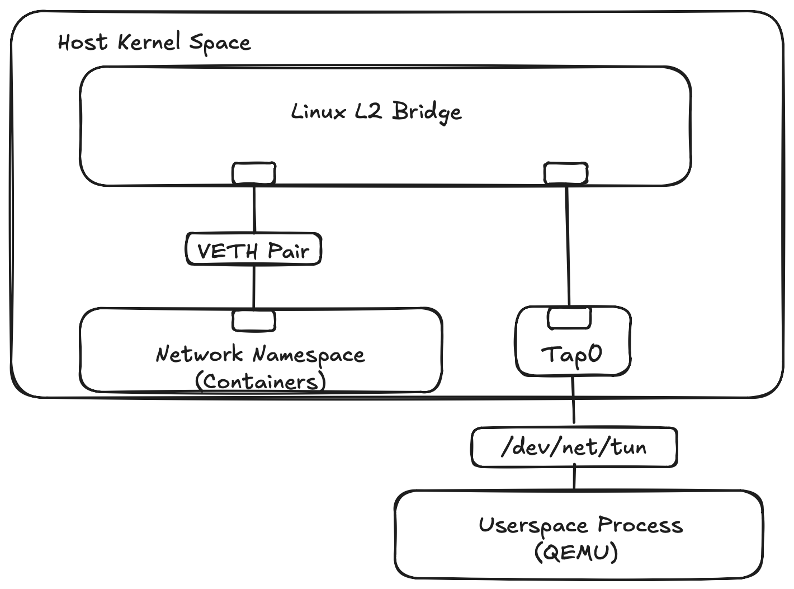

## Intro

This is the first article in a [three part series](../self_hosting/index.md) focused on self hosting publicly facing services.

Virtualization stacks like libvirt, Proxmox, or Docker abstract network creation behind single CLI commands.  The abstractions are convenient but hide the kernel primitives used to create virtualized networks. Knowing these primitives makes it easier to understand how virtual machines and containers connect to the host's network.

This post will manually construct an isolated Layer 2 network and connect user space processes using native iproute tooling.

## Kernel Primitives

We rely on three Linux Kernel components to build virtual Layer 2 networks.

### The Linux Bridge

The bridge is a kernel network object that operates at L2, connecting two or more data segments.  Bridges **work like a physical network switch** by inspecting Ethernet frames and mapping MAC addresses to virtual bridge ports.  When an Ethernet frame enters the bridge, it's destination MAC address is inspected and if found in the bridge's Forwarding Database (FDB), the bridge switches the frame to the mapped egress port.  If the destination MAC address isn't found in the FDB or the destination is to the broadcast address (`FF:FF:FF:FF:FF:FF`), the Ethernet frame is sent to all ports on the bridge except the ingress port.
 
In addition to switching, the Linux bridge supports VLAN tagging and basic support of Spanning Tree Protocol.
 
### The TAP Device

A TAP device is **a virtual Layer 2 network device** that enables user space applications like QEMU to send and receive raw Ethernet frames.  Instead of being backed by a physical network adapter, TAP devices are backed by the `/dev/net/tun` character device node.  When a user space process opens /dev/net/tun, it's accessing the TAP/TUN interface in the kernel to create or attach to a virtual TAP interface. The kernel associates the application's file descriptor with the TAP interface, allowing the application to exchange Ethernet frames with the host kernel.

### The Virtual Ethernet (VETH) Pair

Where a TAP device connects a user space process to the kernel, **a VETH pair connects two kernel network entities directly**. A VETH device  exists as a connected pair of virtual interfaces acting like two ends of a virtual Ethernet cable.  Any Ethernet frame entering one end of the pair immediately exits the other end in kernel memory.  VETH pairs are often used by container engines like Docker, Podman, or LXC for bridging network name spaces to the host level Linux bridge.



## TAP Demonstration
Let's start with creating a Linux bridge and a TAP device. A QEMU virtual machine will use the TAP device to share the host OS network.  The bridge itself operates at Layer 2 and does not require an IP address. Assigning an address to the bridge gives the host's Layer 3 network stack an interface on the bridged network. This allows the host to communicate directly with the connected guests.  Later when routing is enabled, the bridge IP will allow the host to act as the gateway for connected guests.

### Create the Bridge
```shell
# Create the bridge object in the host kernel
ubuntu@bridge-tutorial:~$ sudo ip link add dev br0 type bridge

# Bring the bridge interface state to UP
ubuntu@bridge-tutorial:~$ sudo ip link set dev br0 up

# Assign L3 IP address to the bridge interface
ubuntu@bridge-tutorial:~$ sudo ip addr add 192.168.100.1/24 dev br0

# Verify interface state and has an IP binding
ubuntu@bridge-tutorial:~$ ip -4 addr  show dev br0
4: br0: <NO-CARRIER,BROADCAST,MULTICAST,UP> mtu 1500 qdisc noqueue state DOWN group default qlen 1000
    inet 192.168.100.1/24 scope global br0
       valid_lft forever preferred_lft forever
```

Bridge flags from `ip addr show` output should display `<NO-CARRIER,BROADCAST,MULTICAST,UP>` and `state DOWN`. A bridge will evaluate its operational link state based on attached ports. If there are no member interfaces with an active link carrier, the kernel flags the bridge as `NO-CARRIER` and sets the operational state to `DOWN`.

Once we create the TAP device, attach it to the bridge, and bring link state up on TAP device, the bridge will detect the active port and transition from `state DOWN` to `state UP`.

### Create the TAP device

To create the TAP device:

```shell
# Create persistent TAP interface owned by current user
ubuntu@bridge-tutorial:~$ sudo ip tuntap add dev tap0 mode tap user $USER

# Bind the TAP interface to the bridge switch
ubuntu@bridge-tutorial:~$ sudo ip link set dev tap0 master br0

# Bring the TAP interface state to UP
ubuntu@bridge-tutorial:~$ sudo ip link set dev tap0 up
```

### Start the Guest VM

I'm using QEMU to start the virtual machine that boots from the [standard Alpine ISO image.](https://alpinelinux.org/downloads/) The QEMU command assigns the `tap0` network device created earlier to the VM, `-netdev tap,id=net0,ifname=tap0`.  The file referenced by the `-bios` option was installed with `sudo apt install qemu-efi-aarch64`.

```shell
ubuntu@bridge-tutorial:~$ qemu-system-aarch64 \
    -machine type=virt,gic-version=3 \
    -cpu cortex-a72 \
    -m 1024 \
    -smp 2 \
    -bios /usr/share/qemu-efi-aarch64/QEMU_EFI.fd \
    -cdrom alpine-standard-3.24.1-aarch64.iso \
    -netdev tap,id=net0,ifname=tap0,script=no,downscript=no \
    -device virtio-net-pci,netdev=net0,mac=52:54:00:12:34:56 \
    -nographic \
    -serial mon:stdio
```

After the VM boots, login as `root` with an empty password. (We are booting an Alpine ISO image so no password is set.)  Assign a static IP to eth0.

```shell
# Set the hostname to Alpine to make the shell prompts in the tutorial easier to understand.
localhost:~# hostname alpine

# Statically assign an address to eth0
alpine:~# ip addr add 192.168.100.2/24 dev eth0 

# Enable the eth0 interface
alpine:~# ip link set dev eth0 up

# Assign a default route to the br0 address
alpine:~# ip route add default via 192.168.100.1 dev eth0 

# Ping the gateway on br0
alpine:~# ping -c2 192.168.100.1
PING 192.168.100.1 (192.168.100.1): 56 data bytes
64 bytes from 192.168.100.1: seq=0 ttl=64 time=13.928 ms
64 bytes from 192.168.100.1: seq=1 ttl=64 time=7.542 ms

--- 192.168.100.1 ping statistics ---
2 packets transmitted, 2 packets received, 0% packet loss
round-trip min/avg/max = 7.542/10.735/13.928 ms
```

### Recap the Bridge Tap Environment

Let's review our working bridge tap environment now that it's been built.  We have two new network objects on the host OS, a tap device (tap0) and a bridge (br0).

```shell
ubuntu@bridge-tutorial:~$ ip link show dev br0 
4: br0: <BROADCAST,MULTICAST,UP,LOWER_UP> mtu 1500 qdisc noqueue state UP mode DEFAULT group default qlen 1000
    link/ether 96:91:55:a8:21:52 brd ff:ff:ff:ff:ff:ff
ubuntu@bridge-tutorial:~$ ip link show dev tap0
5: tap0: <BROADCAST,MULTICAST,UP,LOWER_UP> mtu 1500 qdisc fq_codel master br0 state UP mode DEFAULT group default qlen 1000
    link/ether 22:db:85:86:30:1a brd ff:ff:ff:ff:ff:ff
```

We can verify the tap device is bound to the bridge.  If nothing were to print, then we know there's a config issue.

```shell
ubuntu@bridge-tutorial:~$ ip link show master br0
5: tap0: <BROADCAST,MULTICAST,UP,LOWER_UP> mtu 1500 qdisc fq_codel master br0 state UP mode DEFAULT group default qlen 1000
    link/ether 22:db:85:86:30:1a brd ff:ff:ff:ff:ff:ff
```

br0 has an IP assigned to it, but tap0 does not.

```shell
ubuntu@bridge-tutorial:~$ ip -4 addr show dev br0
4: br0: <BROADCAST,MULTICAST,UP,LOWER_UP> mtu 1500 qdisc noqueue state UP group default qlen 1000
    inet 192.168.100.1/24 scope global br0
       valid_lft forever preferred_lft forever
ubuntu@bridge-tutorial:~$ ip -4 addr show dev tap0
ubuntu@bridge-tutorial:~$
```

Remember the bridge and tap devices are L2 network devices.  An IP was assigned to br0 so the host's network stack has an L3 interface on the bridged network. The QEMU command binds tap0 to the VM so it would show as a standard Ethernet device inside the guest OS, `-netdev tap,ifname=tap0`.  When the guest VM was booted, a static IP address was assigned to eth0 inside the guest.  That is why tap0 on the host does not have a IP address. The IP was assigned to the guest's eth0 interface.

### Verify the Layer 2 Environment

To verify packets are crossing the bridge use `tcpdump -e` as "-e" displays link level headers.  This was captured earlier when the Alpine host with mac addresses 52:54:00:12:34:56 was pinging the bridge IP having a mac address of 96:91:55:a8:21:52.

```shell
ubuntu@bridge-tutorial:~$ sudo tcpdump -nn -e  -i br0 icmp
tcpdump: verbose output suppressed, use -v[v]... for full protocol decode
listening on br0, link-type EN10MB (Ethernet), snapshot length 262144 bytes
08:27:43.530966 52:54:00:12:34:56 > 96:91:55:a8:21:52, ethertype IPv4 (0x0800), length 98: 192.168.100.2 > 192.168.100.1: ICMP echo request, id 2473, seq 6, length 64
08:27:43.531042 96:91:55:a8:21:52 > 52:54:00:12:34:56, ethertype IPv4 (0x0800), length 98: 192.168.100.1 > 192.168.100.2: ICMP echo reply, id 2473, seq 6, length 64
^C
2 packets captured
2 packets received by filter
0 packets dropped by kernel
```

Notice when pinging the host's physical network adapter from within the VM, the bridge MAC appears in tcpdump output instead of the host's MAC.

```shell
alpine:~# ping -c1 192.168.252.6                                                       
PING 192.168.252.6 (192.168.252.6): 56 data bytes                                      
64 bytes from 192.168.252.6: seq=0 ttl=64 time=2.525 ms                                
                                                                                       
--- 192.168.252.6 ping statistics ---                                                  
1 packets transmitted, 1 packets received, 0% packet loss                              
round-trip min/avg/max = 2.525/2.525/2.525 ms 
```

```shell
ubuntu@bridge-tutorial:~$ sudo tcpdump -nn -e  -i br0 icmp
tcpdump: verbose output suppressed, use -v[v]... for full protocol decode
listening on br0, link-type EN10MB (Ethernet), snapshot length 262144 bytes
09:00:54.961011 52:54:00:12:34:56 > 96:91:55:a8:21:52, ethertype IPv4 (0x0800), length 98: 192.168.100.2 > 192.168.252.6: ICMP echo request, id 2479, seq 0, length 64
09:00:54.961159 96:91:55:a8:21:52 > 52:54:00:12:34:56, ethertype IPv4 (0x0800), length 98: 192.168.252.6 > 192.168.100.2: ICMP echo reply, id 2479, seq 0, length 64
^C
2 packets captured
2 packets received by filter
0 packets dropped by kernel
```

This happens because br0 is also an interface in the host's network name space.  The Ethernet frame is addressed to the bridge's MAC address, after which the host's L3 IP stack processes the packet.

The bridge command can display the Forwarding Database (FDB) of the bridge.  Permanent entries are statically assigned in the FDB, dynamic entries are learned when traffic passes over the bridge. 

```shell
ubuntu@bridge-tutorial:~$ bridge fdb show vlan 1 
96:91:55:a8:21:52 dev br0 vlan 1 master br0 permanent
22:db:85:86:30:1a dev tap0 vlan 1 master br0 permanent

ubuntu@bridge-tutorial:~$ bridge fdb show dynamic 
52:54:00:12:34:56 dev tap0 master br0 
```

The Alpine VM's MAC address is a dynamic entry associated with tap0. The bridge learned that MAC because frames originating from the VM arrived through that port.

## VETH Demonstration

### Create the Network Name Space 

```shell
# Add an isolated network name space
ubuntu@bridge-tutorial:~$ sudo ip netns add demo-ns

# Verify the network name space existence
ubuntu@bridge-tutorial:~$ sudo ip netns list
demo-ns
```

### Create the VETH Pair

We can reuse the Linux bridge created in the previous demonstration to show how different network name spaces can be connected.  Instead of using QEMU and a TAP device, this will demonstrate how a VETH pair can connect a new network name space to the existing br0 bridge.

This shows another way of connecting a process inside an isolated network name space to the same L2 network without needing a virtual machine.

```shell
# Create the peer interface pair
ubuntu@bridge-tutorial:~$ sudo ip link add veth-host type veth peer name veth-guest

# Attach the host end of the pair to our existing bridge
ubuntu@bridge-tutorial:~$ sudo ip link set veth-host master br0
ubuntu@bridge-tutorial:~$ sudo ip link set veth-host up

# Assign veth-guest to the new network name space
sudo ip link set veth-guest netns demo-ns
```

### Enter the Network Name space

```shell
# Execute an interactive bash shell within demo-ns network scope 
ubuntu@bridge-tutorial:~$ sudo ip netns exec demo-ns /bin/bash 
root@bridge-tutorial:/home/ubuntu#

# Bring up the loopback interface
root@bridge-tutorial:/home/ubuntu# ip link set dev lo up

# Assign an IP from our bridge subnet to the veth endpoint
root@bridge-tutorial:/home/ubuntu# ip addr add 192.168.100.3/24 dev veth-guest
root@bridge-tutorial:/home/ubuntu# ip link set dev veth-guest up

# Set default gateway to the host bridge IP
root@bridge-tutorial:/home/ubuntu# ip route add default via 192.168.100.1 dev veth-guest

# Verify configuration
root@bridge-tutorial:/home/ubuntu# ip -4  addr show dev veth-guest
5: veth-guest@if6: <BROADCAST,MULTICAST,UP,LOWER_UP> mtu 1500 qdisc noqueue state UP group default qlen 1000 link-netnsid 0
    inet 192.168.100.3/24 scope global veth-guest
       valid_lft forever preferred_lft forever

root@bridge-tutorial:/home/ubuntu# ip route
default via 192.168.100.1 dev veth-guest 
192.168.100.0/24 dev veth-guest proto kernel scope link src 192.168.100.3

# Verify networking works by pinging the br0 IP
root@bridge-tutorial:/home/ubuntu# ping -c 2 192.168.100.1
PING 192.168.100.1 (192.168.100.1) 56(84) bytes of data.
64 bytes from 192.168.100.1: icmp_seq=1 ttl=64 time=0.423 ms
64 bytes from 192.168.100.1: icmp_seq=2 ttl=64 time=0.183 ms

--- 192.168.100.1 ping statistics ---
2 packets transmitted, 2 received, 0% packet loss, time 1027ms
rtt min/avg/max/mdev = 0.183/0.303/0.423/0.120 ms
```

### Recap the Bridge VETH environment

There are three network objects with the VETH environment, the bridge (br0 created in the TAP demo) and the VETH pair.

```shell
ubuntu@bridge-tutorial:~$ ip link show dev br0
4: br0: <BROADCAST,MULTICAST,UP,LOWER_UP> mtu 1500 qdisc noqueue state UP mode DEFAULT group default qlen 1000
    link/ether 96:91:55:a8:21:52 brd ff:ff:ff:ff:ff:ff
ubuntu@bridge-tutorial:~$ ip link show type veth
7: veth-host@if6: <BROADCAST,MULTICAST,UP,LOWER_UP> mtu 1500 qdisc noqueue master br0 state UP mode DEFAULT group default qlen 1000
    link/ether da:b6:cc:23:26:ee brd ff:ff:ff:ff:ff:ff link-netns demo-ns
```

The VETH pair should be read as endpoint @ endpoint (veth-host@if6). We originally created a veth-host@veth-guest pair, but veth-guest was moved into the demo-ns network name space where the kernel assigned it index 6 (if6).

```shell
# This is a shell associated with the network namespace. 
root@bridge-tutorial:/home/ubuntu# ip link show type veth
6: veth-guest@if7: <BROADCAST,MULTICAST,UP,LOWER_UP> mtu 1500 qdisc noqueue state UP mode DEFAULT group default qlen 1000
    link/ether b2:6d:6d:83:2b:28 brd ff:ff:ff:ff:ff:ff link-netnsid 0
```

Inside the network name space we see the reverse (veth-guest@if7) where veth-guest interface is present but veth-host was assigned index 7 (if7).

The numeric value in if6 or if7 is an internal kernel interface index (ifindex) so values can differ from whats shown.  Index values are unique to each network name space.

## Reset All Network Changes

All network changes made in this demo are ephemeral.  A **reboot of the host OS** will remove all virtual bridges, TAP and VETH devices, and any network name spaces created during the tutorial.

## Follow up

One thing I didn't demonstrate is how VMs or containers can access off host network resources.  I didn't make any ping attempts to remote domains like `github.com` in this article.  Without additional layer 3 changes, the network ends at the host.  The host can communicate with guests, but the guests can't reach networks external to the host.

This is the next problem to solve. Part 2 will introduce IP forwarding, NAT, and packet mangling to connect this private virtual network to an upstream network.  For update notifications on this series, either subscribe to the [RSS feed](/articles/index.xml) or follow along on my [Bluesky account](https://bsky.app/profile/af9.us).