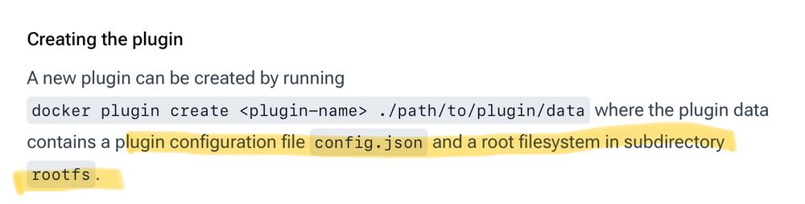

With Docker, it’s not always obvious what storage options exist beyond the built-in **local** volume driver or a traditional **bind mount**.
Exploring Docker volume drivers often turns up archived GitHub repositories or commercially backed plugins tied to specific cloud storage products. The volume 
ecosystem is especially limited for on-premise storage, and many plugins require more privileges than you'd expect.

In this post, I’ll cover how Docker handles volume storage under the hood. I’ll also walkthrough how to create a volume plugin that interacts with remote 
storage without needing CAP_SYS_ADMIN privileges.

## Docker Storage Overview

* **Graph Drivers** (also known as Storage Drivers) manage image and container layers. Examples include, **overlay2**, **zfs**, or **btrfs**.
* **Volume Drivers** manange named volumes and allow data to persist outside of the container lifecycle.

Plugins for Volume Drivers are usually installed as special containers using the **docker plugin** command. Plugin containers run
in their own namespaces and don't behave like normal containers. However, if the plugin includes a shell, it's possible to enter the
namespace using [runc](https://docs.docker.com/engine/extend/#debugging-plugins).

```shell
ubuntu@docker-dev:~/work$ sudo runc --root /run/docker/runtime-runc/plugins.moby list 
ID                                                                 PID         STATUS      BUNDLE                                                                                                                        CREATED                          OWNER
bae595da4deac656921a48f4b3d854992c692777f46db891934310ae863746c1   24503       running     /run/containerd/io.containerd.runtime.v2.task/plugins.moby/bae595da4deac656921a48f4b3d854992c692777f46db891934310ae863746c1   2025-06-27T03:55:42.927740463Z   root

ubuntu@docker-dev:~/work$ sudo runc --root /run/docker/runtime-runc/plugins.moby exec -t bae595da4deac656921a48f4b3d854992c692777f46db891934310ae863746c1 /bin/bash
root@docker-dev:/# ls -lh /myplugin
-rwxr-xr-x 1 root root 5.0M Jun 24 23:24 /myplugin
```

The Docker daemon communicates with all plugins over HTTP, using either a Unix socket or a TCP socket.

## What's Missing


While the interface is simple, expectations around what happens after a volume is mounted are not. Most plugins end up mounting a remote
filesystem like NFS or CIFS, manipulating files as root, or interacting with device nodes like /dev/fuse, all requiring elevated privileges.

To summarize:

* It’s difficult to find unprivileged plugins in the Docker ecosystem.
* Using virtual filesystems (like GlusterFS, SSHFS, or S3FS) requires FUSE, and FUSE needs CAP_SYS_ADMIN.
* A local caching layer for remote storage is not baked into the Docker volume plugin interface.

## The DIY Approach

Let’s say we want a volume plugin that “mounts” a remote volume by downloading files from a remote server.

Here’s a basic outline of how it might work:

* Implement a volume plugin that exposes the Volume Plugin API to the Docker daemon.
* **Create** volume, populates volume metadata needed to later identify the volume within Docker. (The API allows actual filesystem setup to be deferred until Mount.)
* **Mount** volume, will fetch data from the remote server, extract it to a known local path, and return that path to Docker.
* **Unmount** volume, either cleans up the local path or repackages and uploads any changes back to the remote server.

This model avoids the need for root privileges, since it doesn't touch /dev, doesn't rely on FUSE, and doesn’t call mount(2).

## My Interest in Docker Plugins

I like the simplicity of Docker compared to larger orchestration platforms, but I want more from its storage offerings.
When I started looking at existing volume plugins, a few things pushed me toward writing my own.

Many plugins require root-level privileges. I found that avoiding FUSE or skipping filesystems that depend on kernel modules could reduce or eliminate 
this requirement.

Another issue, most volume plugins on GitHub have been archived by their maintainers. I get it, people move on and the Docker community isn't as large 
as it once was.  That said, I found the developer tooling for writing plugins to be a bit clunky. My hope is this post will help fill in gaps and show 
a practical path forward for building a volume plugin.

Finally, most active (not archived) volume plugins I find are designed for cloud storage services. There's a lack of unprivileged lightweight volume 
plugins and I think there's a place for something simplier.

* Streaming read-only config bundles
* CI/CD ephemeral volumes
* Lazy-loading assets over HTTP

These ideas are viable with the current plugin API, just unexplored.

## A simple plugin


After digging into Docker plugins and exploring the current state of the ecosystem, I decided to build a simple plugin to see how far I could get
with minimal privileges and lightweight tooling. I have to admit that the process was both educational and a little frustrating.

### What Didn't Go Smoothly

Docker has a clean CLI and a solid container runtime, but plugin development comes with its share of friction:

* The development loop is slow. Building, loading, and enabling a plugin requires several manual steps. Debugging inside the plugin container via runc (instead of docker plugin) isn’t intuitive.
* Plugin files need to follow a specific directory structure, and you must include an exported container root filesystem in a subdirectory before the plugin can be built.
* The Docker daemon uses a socket path that includes the container ID which is a dynamic value. This caused the daemon to time out when connecting to the plugin until I manually fixed the path. Eventually, I discovered the Go plugin SDK, which handled this more reliably.

### Build Steps

Here’s a high-level overview of the development loop when creating a Docker volume plugin:

1. Write the plugin code.
2. Create a Docker image that contains the plugin.
3. Create a throwaway container from that image.
4. Extract the root filesystem from the container using **docker export**, and untar it into a directory named **rootfs**.
5. Finally, run **docker plugin create** to assemble the plugin from the **rootfs** and a ***config.json*** file.



Fortunately, someone wrapped these steps in a [Makefile](https://github.com/vieux/docker-volume-sshfs/blob/1e0cd2fcb72d6af0a2ad4689faed8c312124517c/Makefile) 
which can be used as a starting point.  Here's a snippet from the docker-volume-sshfs repo.

```make
rootfs:
	@echo "### docker build: rootfs image with docker-volume-sshfs"
	@docker build -q -t ${PLUGIN_NAME}:rootfs .
	@echo "### create rootfs directory in ./plugin/rootfs"
	@mkdir -p ./plugin/rootfs
	@docker create --name tmp ${PLUGIN_NAME}:rootfs
	@docker export tmp | tar -x -C ./plugin/rootfs
	@echo "### copy config.json to ./plugin/"
	@cp config.json ./plugin/
	@docker rm -vf tmp

create:
	@echo "### remove existing plugin ${PLUGIN_NAME}:${PLUGIN_TAG} if exists"
	@docker plugin rm -f ${PLUGIN_NAME}:${PLUGIN_TAG} || true
	@echo "### create new plugin ${PLUGIN_NAME}:${PLUGIN_TAG} from ./plugin"
	@docker plugin create ${PLUGIN_NAME}:${PLUGIN_TAG} ./plugin
```

You’ll also need a **config.json** file ([docs](https://docs.docker.com/engine/extend/config/)) that defines the plugin’s name, entrypoint, socket permissions, 
and other settings. This file goes alongside the rootfs directory when building the plugin.

### Plugin SDK and API documentation

The [go-plugins-helpers](https://github.com/docker/go-plugins-helpers/tree/main/volume) SDK was a big help when building my plugin, though
it's not well advertised.  It provides an interface with method definitions for handling the HTTP communication between the custom plugin and
the Docker Daemon.  

While plugins can technically be written in any language (since the API is just HTTP), this Go SDK was the only official helper library I found.  That said, 
using it is optional.  I came across several projects like rclone and SeaweedFS that implement the plugin protocol without relying on the SDK.

Docker’s documentation is spread across a few key pages. The two most useful I found were:

* The [Plugin API reference](https://docs.docker.com/engine/extend/plugin_api/) describes the HTTP interface and includes example request and response payloads.
* The [Volume plugin overview](https://docs.docker.com/engine/extend/plugins_volume/) includes sections on creating, installing, developing, and debugging plugins.

### Code Highlights

The plugin I built is intentionaly minimal.  When a container calls **mount** on the volume, the function creates a hello.txt file in the volume directory.  
It simulates downloading data from remote storage while keeping things simple:

```Go
func (d *myDriver) Mount(req *volume.MountRequest) (*volume.MountResponse, error) {
	volPath := filepath.Join(pluginRoot, req.Name)

	// Write a hello.txt file
	helloFile := filepath.Join(volPath, "hello.txt")
	err := os.WriteFile(helloFile, []byte("Hello, world!\n"), 0644)
	if err != nil {
		return nil, fmt.Errorf("failed to write hello.txt: %w", err)
	}

	log.Printf("Mount volume: %s -> %s", req.Name, volPath)
	return &volume.MountResponse{Mountpoint: volPath}, nil
}
```

Before a container exits, **unmount** is called.  This function deletes the file from the volume, demonstrating that the basic lifecycle works with user level 
permissions. This step could be used to sync local changes back to remote storage in production code.

```
func (d *myDriver) Unmount(req *volume.UnmountRequest) error {
	volPath := filepath.Join(pluginRoot, req.Name)
	helloFile := filepath.Join(volPath, "hello.txt")

	// Simulate cleanup
	if err := os.Remove(helloFile); err != nil && !os.IsNotExist(err) {
		return fmt.Errorf("unmount cleanup error: %w", err)
	}

	log.Printf("Unmount volume: %s (removed hello.txt)", req.Name)
	return nil
}
 ```

### Build WalkThrough

Now for the good part.  A full walkthrough of how I built and tested the custom plugin. Here are the files involved:

* [go.mod](./assets/go.mod)
* [go.sum](./assets/go.sum)
* [myplugin.go](./assets/myplugin.go)
* [Dockerfile](./assets/Dockerfile)
* [config.json](./assets/config.json)

1. Build the Go code and create a plugin image

```shell
$ docker build -t rootfsimage .
[+] Building 6.1s (13/13) FINISHED                                                                                                   docker:default
 => [internal] load build definition from Dockerfile                                                                                 0.0s
 => => transferring dockerfile: 461B                                                                                                 0.0s
 => [internal] load metadata for docker.io/library/ubuntu:oracular                                                                   0.9s
 => [internal] load .dockerignore                                                                                                    0.0s
 => => transferring context: 2B                                                                                                      0.0s
 => [internal] load build context                                                                                                    0.0s
 => => transferring context: 32.89kB                                                                                                 0.0s
 => [builder 1/6] FROM docker.io/library/ubuntu:oracular@sha256:707879280c0bbfe6cbeb3ae1a85b564ea2356b5310a122c225b92cb3d1ed131b     0.0s
 => CACHED [builder 2/6] RUN apt-get update && apt-get install golang-go ca-certificates -y                                          0.0s
 => [builder 3/6] COPY . /build                                                                                                      0.0s
 => [builder 4/6] WORKDIR /build                                                                                                     0.0s
 => [builder 5/6] RUN go mod tidy                                                                                                    0.7s
 => [builder 6/6] RUN CGO_ENABLED=0 go build -ldflags="-s -w -extldflags "-static"" -tags netgo,osusergo -o myplugin                 4.3s 
 => CACHED [stage-1 2/3] RUN mkdir -p /run/docker/plugins /var/lib/myplugin/volumes                                                  0.0s 
 => [stage-1 3/3] COPY --from=builder /build/myplugin /myplugin                                                                      0.0s 
 => exporting to image                                                                                                               0.0s 
 => => exporting layers                                                                                                              0.0s 
 => => writing image sha256:a3d2dee4d6cb8112f538a16056dc42b9761bda43f7f279b2a1f202a7a8e5f8ae                                         0.0s
 => => naming to docker.io/library/rootfsimage      
```

2. Create a container from the rootfs image and export the container’s root filesystem to a tar file.

```
$ id=$(docker create rootfsimage true)  

$ echo $id
13cf6219737999bd54f7fc2537bc1218f42d9c45d92f79c4726c1422e81b348e

$ sudo docker export "$id" -o rootfs.tar 

$ ls -l rootfs.tar 
-rw------- 1 ubuntu ubuntu 110620160 Jun 26 23:07 rootfs.tar
```

3. Docker plugin tooling expects a rootfs directory and a config.json file in the current directory. The config isn’t part of the exported filesystem, so it's 
provided separately:

```
$ cp ~/Downloads/config.json .
$ sudo tar -xf ./rootfs.tar -C ./rootfs/ 

$ ls -l 
total 8
-rw-r--r--  1 root root  183 Jun 23 15:26 config.json
drwxr-xr-x 17 root root 4096 Jun 24 16:28 rootfs

$ ls rootfs
bin  boot  dev  etc  home  lib  media  mnt  myplugin  opt  proc  root  run  sbin  srv  sys  tmp  usr  var
```

4. Create and enable the plugin. 

```
$ sudo docker plugin create myplugin . 
myplugin

$ docker plugin enable myplugin:latest
myplugin:latest

$ docker plugin ls
ID             NAME              DESCRIPTION                         ENABLED
d5f63b80f0b0   myplugin:latest   Example HTTP-backed volume plugin   true
```

5. Create a volume with the plugin and inspect it.

```
$ docker volume create -d myplugin:latest abc123
abc123

$ docker volume ls
DRIVER            VOLUME NAME
myplugin:latest   abc123

$ docker volume inspect abc123 
[
    {
        "CreatedAt": "0001-01-01T00:00:00Z",
        "Driver": "myplugin:latest",
        "Labels": null,
        "Mountpoint": "/var/lib/myplugin/volumes/abc123",
        "Name": "abc123",
        "Options": null,
        "Scope": "local"
    }
]
```

6. Mount the volume with a container.

```
$ docker run -it --rm  -v abc123:/mnt alpine

/ # ls -l /mnt
total 4
-rw-r--r--    1 root     root            14 Jun 27 06:17 hello.txt

/ # cat /mnt/hello.txt 
Hello, world!
```

7. Additional information for Docker events can be found inside systemd logs.

```
$ journalctl -u docker.service  | tail -3
Jun 26 23:17:55 docker-dev dockerd[7976]: time="2025-06-26T23:17:55-07:00" level=error msg="2025/06/27 06:17:55 Mount volume: abc123 -> /var/lib/myplugin/volumes/abc123" plugin=d5f63b80f0b091582e00bfed7bd6d33e885fef876e151558a37ae5eaf05e5443
Jun 26 23:18:04 docker-dev dockerd[7976]: time="2025-06-26T23:18:04.543532903-07:00" level=info msg="ignoring event" container=0e6fdf10db3da9c9b5bc04bbe6abac6b23225578e796e89fe859c1d17fc57f0f module=libcontainerd namespace=moby topic=/tasks/delete type="*events.TaskDelete"
Jun 26 23:18:04 docker-dev dockerd[7976]: time="2025-06-26T23:18:04-07:00" level=error msg="2025/06/27 06:18:04 Unmount volume: abc123 (removed hello.txt)" plugin=d5f63b80f0b091582e00bfed7bd6d33e885fef876e151558a37ae5eaf05e5443
```

## Closing 

I'm excited about learning how to create plugins for Docker and turning my notes into this post.  

I made a previous post on using tar archives as an [object store](https://amf3.github.io/articles/storage/tar_objectstore/) and I recently posted about compression ratios on Bluesky social.  Stay tuned to find out where these posts are headed.



If you'ver ever built a Docker plugin or struggled with Docker storage, I'd like to hear about it.  Any questions or ideas, reach out and 
leave a comment.  

Until next time, keep your volumes clean and your containers stateless.
