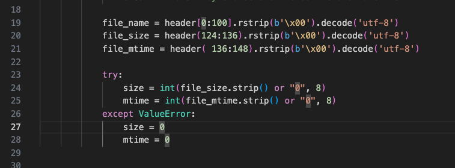
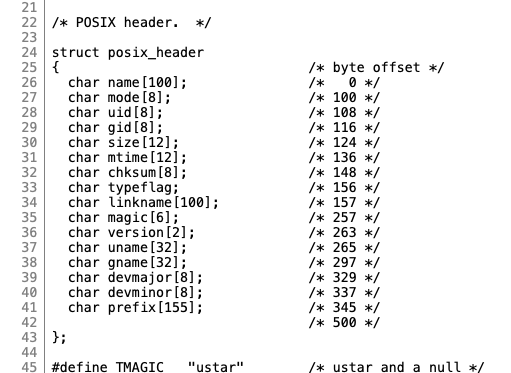

I'm looking at how object storage systems manage data on disk. Especially the idea of using append only archives with an index for fast retrieveal.  While reading
Facebook's Haystack design, I noticed similarities to the tar file format and the potential to implement something similar at the local scale.

## Haystack Overview

There are several components mentioned in the original [Haystack paper](https://www.usenix.org/legacy/event/osdi10/tech/full_papers/Beaver.pdf), but at 
the core is the Haystack Store, where end user image files are physically kept. Instead of writing files directly to the filesystem, images are appended 
to a large file called a **volume**, which acts as an append-only archive. Each volume is typically capped at around 100 GB and is aligned to 8-byte 
offsets.  Image files within this volume are referred to as **needles**.


A volume begins with a superblock (the paper doesn’t describe this in detail), followed by the header for the first needle (file). Each needle within 
the volume has its own header, containing metadata like file size, checksums, and flags. The flags field includes a bit to indicate deletion status.

Since the volume is append-only, deletions don’t reclaim space—they're simply marked as deleted in the needle’s header. A background process can later 
compact the volume if needed. To keep track of where each needle is within the file, an in-memory index maps file IDs to byte offsets.

When a read request comes in, the Haystack Store performs a direct seek to the needle’s offset, verifies the flags to check if it's deleted, and returns 
the data if is not tombstoned.  Deletions update both the in-memory index and the needle’s header to mark the entry as removed.

This model provides two big wins:

* **Storage efficiency:** Small files, like 1 KB thumbnails, don’t waste space the way they would on a traditional filesystem with 4 KB blocks. Instead of allocating a full block per file, they're packed into a shared archive.
* **Fast retrieval:** There’s no need to scan directory structures or fetch inode metadata. With an open file handle to the volume and an in-memory index, reads are just a seek and a read.

## Tar Storage

The tape archive format (**tar**) is surprisingly similar to the Haystack volume. While tar files don’t implement a superblock, each file entry is stored at a 512-byte 
aligned offset, and each file includes its own metadata header. This format allows us to calculate the offset of each file within the archive.

Here’s a hexdump of a simple test.tar archive containing two files: a.txt and b.txt.


In this example:

* a.txt contains the string "foo\n", and b.txt contains "bar\n".
* Each file is preceded by a 512-byte header containing metadata like filename, permissions, and ownership.
* Since a.txt is only 4 bytes long, it’s followed by null padding to align the next file (b.txt) to the 512-byte boundary.
* The offset for b.txt starts at 0x400 (1024 bytes), which is a clean 512-byte multiple.

Although tar uses more padding than Haystack (which aligns to 8-byte offsets), its fixed alignment still enables efficient offset tracking and data retrieval. Once the 
byte offsets of each file are known, accessing a file is just a matter of seeking to the right position and reading the data.

Tar also provides nice recovery properties: 

* An index of offsets can always be created by reading the tar file and recording the header positions as offsets.
* Because this is a standard tar file, common tools like tar and cpio can extract the objects directly without the need for custom tooling.

## Python Prototype

Tar archives are typically read sequentially from start to finish. But if we build an index of byte offsets, we can enable random access to individual files. 
Let’s explore this with a prototype in Python using the test.tar archive shown in the earlier hexdump. A copy of the archive can be downloaded 
from [here](./assets/test.tar).

We have two options for building this prototype:

* The hard way, by manually parsing byte offsets directly from the tar header.



* The batteries-included way, using Python’s built-in **tarfile** module to extract header information cleanly.

If you’re curious, fields and byte-offsets within file headers are listed 
in [GNU's tar header definition]((https://cgit.git.savannah.gnu.org/cgit/tar.git/tree/src/tar.h#n24)).



Here’s an example of the batteries-included approach using the **tarfile** module. I’ll scan the archive, read each file’s size and data offset, and store that in a dictionary:

```python
#!/usr/bin/env python3
import math
import tarfile
from collections import defaultdict
from typing import Dict

ARCHIVE_FILE = "test.tar"
BYTE_ALIGNMENT = 512

def read_header(archive: str) -> Dict:
    entities = defaultdict(list)
    header_offset = 0
    with open(archive, 'rb') as f:
        while True:
            f.seek(header_offset)
            header = f.read(BYTE_ALIGNMENT)
            if header == b'\0' * BYTE_ALIGNMENT:
                break  # End of archive, trailer will contain two 512-byte blocks of zeros

            try:
                tarinfo = tarfile.TarInfo.frombuf(header, encoding="utf-8", errors="surrogateescape")
                file_name = tarinfo.name
                file_size = tarinfo.size
                data_offset = header_offset + BYTE_ALIGNMENT
                entities[file_name].append([file_size, data_offset])
            except Exception as e:
                print(f"Error parsing header at offset {header_offset}: {e}")
                break

            padding = math.ceil(file_size / BYTE_ALIGNMENT) * BYTE_ALIGNMENT
            header_offset += BYTE_ALIGNMENT + padding

    return entities

tar_data = read_header(ARCHIVE_FILE)
for file_name, attributes in tar_data.items():
    for attribute in attributes:
        print(f"filename: {file_name:<10} attributes: file_size: {attribute[0]:<6} data_offset: {attribute[1]:<6}")
```

Example output.

```shell
% python offsets.py
filename: a.txt      attributes: file_size: 4      data_offset: 512   
filename: a.txt      attributes: file_size: 13     data_offset: 2560  
filename: b.txt      attributes: file_size: 4      data_offset: 1536  
```

Notice that a.txt appears twice, each with a different file size and offset. This is expected. It’s possible to append files to a tar archive using **tar -rf**.
When a file is re-added, it becomes the newer version.

In our example archive file, **a.txt** was modified and appended, producing two versions in the archive. Traditional tar extraction reads from the beginning and
overwrites earlier entries as it encounters newer ones. But by having an index of offsets, I can seek directly to either version and extract it manually.

Here’s a helper function to extract a specific version of a file:

```python
def extract_file(archive: str, file_name: str, offset: int, read_bytes: int):
    try:
        with open(archive, 'rb') as f:
            f.seek(offset)
            data = f.read(read_bytes)
            with open(f"{file_name}@{offset:08x}", 'wb') as out:
                out.write(data)
    except Exception as e:
        print(f"Error extracting {file_name} at offset: {offset:08x}")
```

Add the following lines in main to extract both versions of **a.txt**:

```python
extract_file(ARCHIVE_FILE, "a.txt", 512, 4)
extract_file(ARCHIVE_FILE, "a.txt", 2560, 13)
```

And the result:

```shell
% ls -latr a.txt@*
-rw-r--r--@ 1 adam  staff   4 Jun  6 22:07 a.txt@00000200
-rw-r--r--@ 1 adam  staff  13 Jun  6 22:07 a.txt@00000a00

% cat a.txt@00000200
foo

% cat a.txt@00000a00
foo
fooooooo
```

This demonstrates simple object versioning using nothing more than tar’s existing append behavior and a bit of byte-level introspection.

## Trade-Offs and Limitations

As with Haystack, there's not an efficient way to delete content from a tar archive without rewriting the entire file. Instead, deletion requires marking entries 
as removed in the offsets database. Unlike Haystack which has explicit flags in its header, tar headers offer no such field. Meaning if we lose the index, we
can no longer distinguish active content from deleted entries by scanning the archive.

The data removal limitation also contributes to archive fragmentation. Until a process rewrites the archive to remove tombstoned data, deleted files remain in place, 
consuming storage.

Another trade-off lies in tar's alignment strategy, both headers and data are aligned to 512-byte blocks. In typical usage, tar archives are compressed, which 
minimizes the overhead of null padding. But for this design to support random access, the archive must remain uncompressed. Filesystems like ZFS and Btrfs can 
apply transparent compression at the block level, but relying on underlying filesystem isn't ideal for portability. Haystack uses 8-byte alignment, which results 
in less padding and more efficient use of space.

Also worth noting, my prototype doesn’t implement any kind of write locking. If this were used in a concurrent setting like a web application storing 
assets, appends would require locking the archive to prevent corruption.

## Future Opportunities

Sharding across multiple archive files per bucket (directory) would be one enhancement. It would allow for round-robin writes with multiple appenders, 
improving concurrency. Using multiple archive files per bucket also provides a mechanism to cap archive file sizes.

A mechanism for tombstoning files within an archive is also needed. As seen in the earlier hexdump, it might be possible to repurpose an existing header field to mark 
content as deleted.  This would allow the offsets database to be reconstructed later, even after a crash or loss of metadata. Another idea is to write custom metadata 
into the unused space within the 512-byte header block.  Whether this breaks compatibility with standard tar utilities remains an open question.

Compression and encryption are also worth exploring. Because the prototype seeks directly to file offsets and reads raw byte ranges, it’s feasible to compress file 
content before appending it to the archive. Retrieval would involve decompressing on the fly after seeking to the file location within the archive. Similarly, 
data-at-rest encryption could be supported by encrypting file contents during the write path and decrypting during reads. This allows per-object confidentiality 
without relying on full-disk encryption or underlying filesystem support.

## Final Thoughts

It's oddly satisfying to bend old standards to new purposes, like using the tar format as the basis of an object store.  Putting this post together 
has been a reminder on the types of challenges distributed file systems create when separating metadata from the data.  Simple things like marking 
a file as deleted become complicated.

Let me know if this topic is interesting or you have follow-up suggestions.  I can be reached at [Bluesky](https://bsky.app/profile/af9.us).

