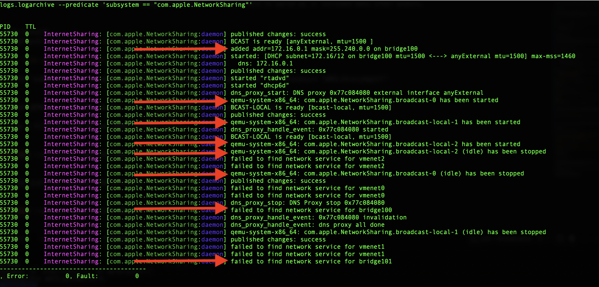
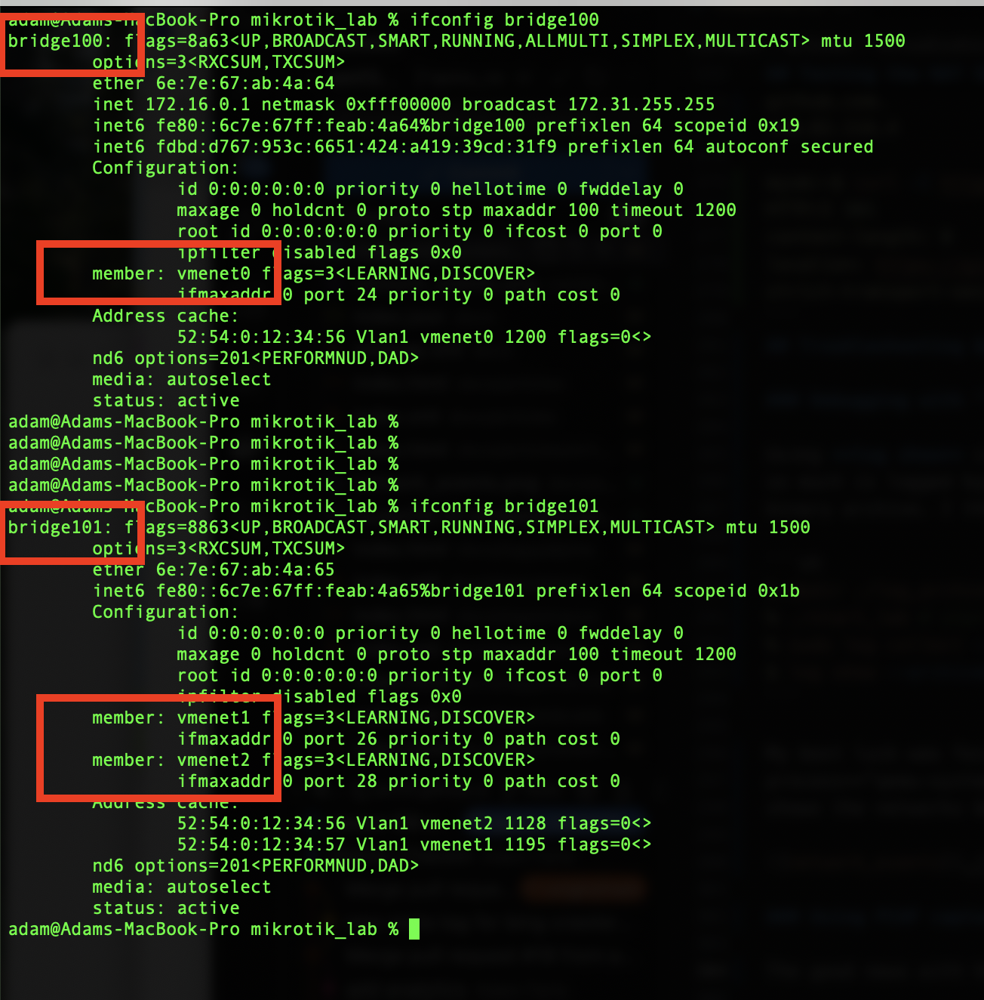
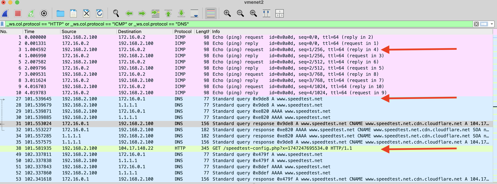

[UTM](https://github.com/utmapp/UTM) and [Multipass](https://canonical.com/multipass) are great apps for virtualization on macOS.  
But I wanted a lighter-weight approach by invoking QEMU directly.  Which meant I needed to understand how QEMU's networking options interact 
with the `vmnet` virtualization API on macOS.  

This becomes especially important when dealing with VM-to-VM connections, network isolation, and bridging on macOS.

In this post, I'll walk through creating a simple QEMU-based networking lab.

- Set up RouterOS and Alpine Linux VMs using QEMU on macOS
- Connect VMs with Apple's Hypervisor `vmnet` networking APIs
- Use unified logging to troubleshoot QEMU network issues on macOS

## Lab Setup Overview

The network diagram shows the network topology used in this lab.  Both VMs run on on the 
same macOS host and connected to virtual network interfaces using QEMU's support for Apple's **vmnet** virtualization API.

The RouterOS VM has two virtual network interfaces, which allows it to route traffic between the Alpine Linux VM and the physical local area network.


## QEMU Networking on macOS

Let's review the **vmnet.shared** and **vmnet.host** labels in the Network1 and Network2 boxes.

- [**vmnet.shared**](https://www.qemu.org/docs/master/interop/qemu-qmp-ref.html#object-QMP-net.NetdevVmnetSharedOptions): Allows traffic from the VM to reach the Internet using a built-in network address translation (NAT) feature. This is similar to how UTM’s "shared network" mode works.

- [**vmnet.host**](https://www.qemu.org/docs/master/interop/qemu-qmp-ref.html#object-QMP-net.NetdevVmnetHostOptions): Traffic can only reach the macOS host and other VMs on the same host-mode network. This mode **does not** provide Internet access.


Since the Alpine Linux VM is only connected to the `vmnet.host` network, and that network cannot reach the Internet, we know the RouterOS VM must be acting as the gateway. It routes traffic between `Network2` (host-only) and `Network1` (shared). You can confirm this by watching interface packet counts on RouterOS.

### Triple NAT!  

As a fun side note, traffic from the Alpine VM to the Internet passes through **three layers of NAT**:

1. **RouterOS VM NAT:** Alpine’s traffic is translated as it passes through RouterOS (ether2 → ether1).
2. **macOS vmnet NAT:** `vmnet0` (shared mode) applies another layer of NAT as it exits to the host’s physical LAN.
3. **Physical Router NAT:** Finally, the home router applies NAT before sending packets to the Internet.

### Other QEMU Network Backends

To see a complete list of network backends supported by QEMU: 

```cmd
%  qemu-system-x86_64 -netdev help  
Available netdev backend types:
socket
stream
dgram
hubport
tap
user
vde
bridge
vhost-user
vmnet-host
vmnet-shared
```

A few notes about QEMU network backends:

**socket** and **user**: Built into QEMU and don’t require elevated privileges. Great for quick VMs, but they don’t behave like traditional network bridges. You can’t easily interconnect multiple VMs.

**tap**: Closer to a traditional bridged network and supports full traffic pass-through. However, it requires setup outside of QEMU and isn’t available on macOS, since tap interfaces depend on kernel extensions (which Apple no longer supports).

**vmnet**: The backend is macOS-native and works out of the box with Apple’s Hypervisor Framework.  It lets QEMU manage the bridge interfaces directly so no extra tooling is needed. Win!

## Creating the VMs

### RouterOS VM

RouterOS "Cloud Hosted Router" (CHR) is a commercial product with a "free to use" license that limits upload speed to 1 Mbps. While a paid license is available
to remove the upload limit, the restriction doesn't prevent me from validating changes before deploying them to physical networks.

One can download the CHR image from [MikroTik’s download page](https://mikrotik.com/download). I used the stable 7.x version and chose the **Raw disk image** — which is x86 (not ARM).

> 💡 In hindsight, the ARM image might be more appropriate for Apple Silicon, but the x86 image works fine.


---

First, convert the raw image to `qcow2` format. This allows snapshotting the VM, making it easy to roll back from bad config changes.

```sh
 % qemu-img convert -f raw -O qcow2 chr-7.18.2.img chr-7.18.2.qcow2
 % qemu-img snapshot -c original_image chr-7.18.2.qcow2
 % qemu-img info chr-7.18.2.qcow2 
image: chr-7.18.2.qcow2
file format: qcow2
virtual size: 128 MiB (134217728 bytes)
disk size: 44.2 MiB
cluster_size: 65536
Snapshot list:
ID      TAG               VM_SIZE                DATE        VM_CLOCK     ICOUNT
1       original_image        0 B 2025-05-08 22:40:36  0000:00:00.000          0
Format specific information:
    compat: 1.1
    compression type: zlib
    lazy refcounts: false
    refcount bits: 16
    corrupt: false
    extended l2: false
Child node '/file':
    filename: chr-7.18.2.qcow2
    protocol type: file
    file length: 44.2 MiB (46333952 bytes)
    disk size: 44.2 MiB
```

Now, start the RouterOS VM and create the two virtual networks with QEMU.

```sh
sudo qemu-system-x86_64  -m 2048 -smp cpus=4 -serial mon:stdio  \
    -device virtio-scsi-pci,id=scsi0 \
    -drive file=./chr-7.18.2.qcow2,if=none,format=qcow2,discard=unmap,id=hda \
    -device scsi-hd,drive=hda,bus=scsi0.0 \
    -device virtio-net-pci,netdev=net1 \
    -netdev vmnet-shared,id=net1,start-address=172.16.0.1,end-address=172.31.255.254,subnet-mask=255.240.0.0 \
    -device virtio-net-pci,netdev=net2 \
    -netdev vmnet-host,id=net2,start-address=192.168.2.1,end-address=192.168.2.254,subnet-mask=255.255.255.0,net-uuid=154780B0-F499-4968-9B20-E58C02FDF5FB
```

- Uses sudo to create vmnet interfaces (required on macOS).
- Allocates 2 GB of RAM and 4 vCPUs.
- Opens a serial console in the terminal (handy for copy/paste).
- Attaches two network devices:
     - vmnet-shared for simulated external Internet.
     - vmnet-host for internal traffic (private LAN).
- IP ranges must follow [RFC 1918](https://datatracker.ietf.org/doc/html/rfc1918) allocation.
- Using net-uuid disables the macOS DHCP server for the vmnet-host network.
     - Required as we want the RouterOS VM to respond with DHCP replies for vmnet-host traffic.
     - Generate the UUID with **/usr/bin/uuidgen**.

Once RouterOS boots, log in with username **admin** and press **Enter** for a blank password. You’ll be prompted to set a new one.

To list interfaces:

```sh
[admin@MikroTik] > /interface print 
Flags: R - RUNNING
Columns: NAME, TYPE, ACTUAL-MTU, MAC-ADDRESS
#   NAME    TYPE      ACTUAL-MTU  MAC-ADDRESS      
0 R ether1  ether           1500  52:54:00:12:34:56
1 R ether2  ether           1500  52:54:00:12:34:57
2 R lo      loopback       65536  00:00:00:00:00:00
```

To check assigned IPs:

```sh
[admin@MikroTik] > /ip/address print
Flags: D - DYNAMIC
Columns: ADDRESS, NETWORK, INTERFACE
#   ADDRESS        NETWORK     INTERFACE
0 D 172.16.0.2/12  172.16.0.0  ether1
```


Only one IP is listed — why?  The vmnet-shared interface (ether1) has DHCP enabled by Apple’s Hypervisor framework. RouterOS sends a DHCP 
request and gets an IP, similar to how a home router works. Meanwhile, vmnet-host has DHCP disabled, so we must assign a static IP to ether2 
on the router.


#### Minimal Configuration Steps

Here are the minimum configuration steps to route traffic:

- assign a static IP on ether2
- create a dhcpd server
- enable NAT  

```sh
[admin@MikroTik] > /ip address add address=192.168.2.1/24 interface=ether2 network=192.168.2.0

[admin@MikroTik] > /ip pool add name=dhcp ranges=192.168.2.50-192.168.2.100
[admin@MikroTik] > /ip dhcp-server add address-pool=dhcp interface=ether2 lease-time=1h name=defconf
[admin@MikroTik] > /ip dhcp-server network add address=192.168.2.0/24 comment=defconf dns-server=172.16.0.1,1.1.1.1 gateway=192.168.2.1

[admin@MikroTik] > /ip firewall nat add action=masquerade chain=srcnat out-interface=ether1
```
> ⚠️ The example does not set any firewall rules. Use it as a starting point only.


To gracefully shutdown the router
```sh
[admin@MikroTik] > /system shutdown
```

Answer y when prompted. Or, leave the router running. It will be used again shortly.


### Alpine Linux VM

An Alpine ISO needs to be downloaded and installed onto a virtual hard disk.  I recommend using the **user** network mentioned earlier
for the install as additional packages will need to be downloaded from the Internet.  The standard x86_64 image can be retrieved from the Alpine Linux [downloads page](https://alpinelinux.org/downloads/).

Create a disk image to install the OS to with the qemu-img command.  The options will use the qcow2 format with a max size of 2GB.

```sh
% qemu-img create -f qcow2 alpine_disk.qcow2 2G
```

Next step is to start a VM that boots from the Alpine ISO and connects to the Internet with the user network.  Because versions change, be 
sure to replace the ISO filename in the **-cdrom** option with the one that was downloaded.

```sh
% qemu-system-x86_64  -m 2048 -smp cpus=4 -serial stdio  \
    -boot once=d \
    -cdrom ./alpine-standard-3.21.2-x86_64.iso \
    -hda ./alpine_disk.qcow2 \
    -net nic,model=virtio -net user
```

Once the VM has started, login as "root" and hit Enter for the empty password.  Next run **setup-alpine** and follow the prompts.
Here are suggested answers to some of the prompts:

- Select **dhcp** for eth0.
- Choose **chrony** as the network time server.
- Accept the default of **1** when asked which "apk-mirror" to use.
- When prompted about the install disk, select **sda**.
- Answer **sys** to the "how would you like to use it" question.

When the installation script is complete, type **reboot** and use the new root password set during the install.  With 
the `-boot once=d` option, the VM will skip the ISO and boot directly from the newly installed virtual disk.

Log in as root and install the dig and curl commands.

```cmd
# apk add bind-tools curl ca-certificates
```   

When the package install has completed, gracefully shutdown the VM with **poweroff** command.

## Testing the NAT Setup

Check that the RouterOS VM is still running in the other terminal. It's acting as the NAT gateway for the Alpine VM and must be 
active for Internet access to work.  Then connect the new Alpine Linux VM to Network2 (vmnet-host) with this QEMU command.

```sh
% sudo qemu-system-x86_64  -m 2048 -smp cpus=4 -serial mon:stdio  \
        -boot c \
        -hda alpine_disk.qcow2 \
        -device virtio-net-pci,netdev=net2 \
        -netdev vmnet-host,id=net2,start-address=192.168.2.1,end-address=192.168.2.254,subnet-mask=255.255.255.0,net-uuid=154780B0-F499-4968-9B20-E58C02FDF5FB
```

Log into the Alpine VM and verify it can reach the Internet.

```sh
myvm:~$ ip addr show eth0         # Confirm the IP is in the 192.168.2.x network range
    ...
    inet 192.168.2.100/24 scope global eth0
    ...


myvm:~$ ip route show             # Confirm the default route is 192.168.2.1
default via 192.168.2.1 dev eth0  metric 202 


myvm:~$ cat /etc/resolv.conf      # Confirm the DNS servers were set
nameserver 172.16.0.1
nameserver 1.1.1.1


myvm:~$ ping -qc 3 1.1.1.1        # test ping to 1.1.1.1 on the Internet
PING 1.1.1.1 (1.1.1.1): 56 data bytes

--- 1.1.1.1 ping statistics ---
3 packets transmitted, 3 packets received, 0% packet loss
...


myvm:~$ dig @172.16.0.1 -t a +short www.github.com  # test vmnet name resolution works 
github.com.
140.82.116.4


myvm:~$ curl -I https://www.github.com              # test that I can fetch a webpage
HTTP/2 301 
...
```

If all of the above checks pass, your Alpine VM is correctly NAT'd through the RouterOS VM and can reach the Internet.

## Troubleshooting & Gotchas

### Debugging with Unified Logging

macOS logs a large volume of network-related events, and it can be tricky to isolate the relevant ones. Fortunately, the `log show`
and `log collect` tools make it easier to filter and investigate.

Start by capturing a snapshot of system logs around the time your VMs are active:

```sh
% mkdir ./log_archive
% ./start_lab # start the VMs with a shell script
% sudo log collect --output ./log_archive --last 3m  # capture the previous 3 minutes of log events.
```

This captures the previous 3 minutes of logs and stores them in a binary archive. Then query the relevant subsystem:

```sh
% log show --archive log_archive/system_logs.logarchive --predicate 'subsystem == "com.apple.NetworkSharing"'  
```

I found the `subsystem == "com.apple.NetworkSharing"` query provided the most useful results.  Using other filters like `subsystem == "com.apple.network"` 
or `process == "qemu-system-x86_64"` included many unrelated events and were a little overwhelming.  This screenshot shows the networks being created 
when the VMs are started and then torn down when the VMs are stopped.



### Packet Captures with Wireshark or tcpdump

Because QEMU uses virtual network interfaces, it's possible to monitor VM traffic directly from macOS using tools like tcpdump or Wireshark.  Use the 
`ifconfig` command to identify which vmenet interfaces are active and which bridge they are mapped to.



Using Wireshark on the correct interface reveals detailed traffic flows. In this example capture, we see:

* ICMP ping requests to the router’s external interface
* A DNS lookup for speedtest.net
* An HTTP GET request initiating the speed test



### Other quirks

I wrote a simple C program to list the interfaces created by QEMU but ran into permission errors.  It turns out that macOS protects the vmnet APIs
behind System Integrity Protection (SIP). To access them, binaries must be code-signed with a full Apple Developer certificate, 
which I don’t have (and didn’t want to pay for). Fortunately, macOS’s unified logging system provided helpful insight.

---

Another issue I encountered was with subnet settings in the router configs. At one point, I accidentally assigned 192.168.2.1/32 instead 
of 192.168.2.1/24 to the host-only interface on the RouterOS VM. This broke routing for the two VMs, blocking the Alpine VM from reaching the Internet.

---

At first glance QEMU’s socket-based networking may seem like a good replacement for bridged networking. It’s built into QEMU and doesn’t require
elevated privileges. So why not use it? It turns out that socket networking is intended for point-to-point communication between specific QEMU instances, like
TCP client/server setups. Socket networking doesn’t support general Ethernet bridging or broadcast traffic. For a more flexible setup that allows multiple VMs 
to communicate freely (and with the host), you still need tap or vmnet.

## Conclusion 

Running QEMU directly on macOS isn’t the most beginner-friendly experience, but it was a great learning opportunity.  I have a better
appreciation for why tools like UTM or Multipass exist as wrappers around QEMU.

Next time I might try replacing the x86 images with arm64 images to explore the performance differences.  I'm also considering writing my own QEMU wrapper,
partly for fun and partly for continuious integration purposes.

If you enjoyed this or want to follow along with future experiments, follow me on [Bluesky](https://bsky.app/profile/af9.us). Thanks for reading!
