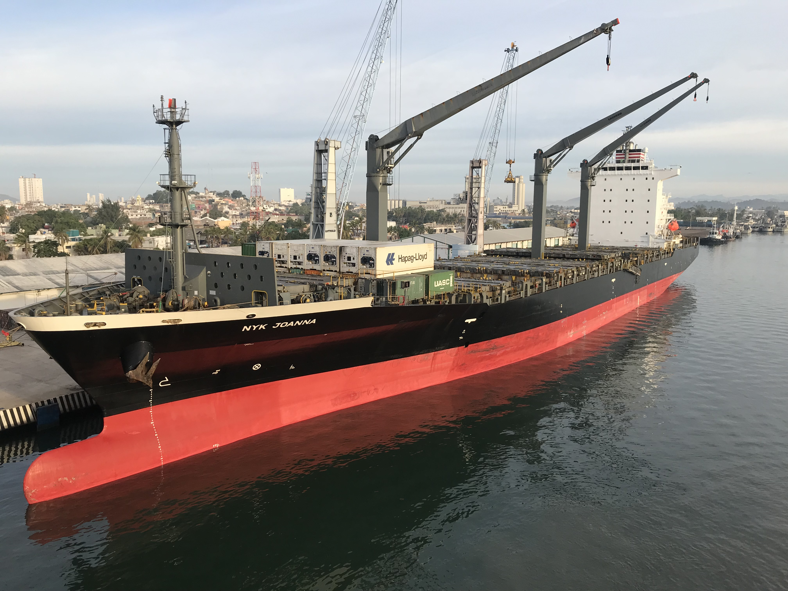

Many container images start with `FROM python:3.x`. What gets imported is not only Python, its a preassembled filesystem
of decisions you didn't make.  Understanding what's inherited from the base image is key to building container images.  Instead of implicitly trusting
what's included with the base image, think of the image as a collection of artifacts that are intentionally assembled.

## Large Container Images

The [official Python](https://hub.docker.com/_/python) container image hosted on Docker Hub is a great demonstration of inheriting unknown layers.
For Linux environments, the Python image comes with either a Debian or Alpine base image. Both base images come with additional applications
not required by Python.

The Debian based image ships with a Perl interpreter.  Yes, you read that correctly.

```shell
 % docker run --rm -it python:3.14.3-trixie /bin/perl -v 

This is perl 5, version 40, subversion 1 (v5.40.1) built for aarch64-linux-gnu-thread-multi
(with 48 registered patches, see perl -V for more detail)

Copyright 1987-2025, Larry Wall
```

Perl isn’t there for Python.  It’s a legacy dependency inherited from Debian Trixie.  To be clear, Perl is not a Python dependency or requirement.

The Python container image built on Alpine is better focused, but still includes tools like `showkey`, `lsusb`, and `chvt`. These utilities interact with
physical keyboards, USB buses, and Linux virtual consoles.  Things that don't exist in the typical container environment.

Both images demonstrate inheritance issues that can be avoided with declarative builds.

## Curated Run times

Container images from either the [Distroless](https://github.com/GoogleContainerTools/distroless) or
[Docker Hardened Image](https://github.com/docker-hardened-images) (DHI) projects provide a curated runtime by starting with a complete distribution and
aggressively remove shells, package managers, development tools, and unnecessary services.

However while exploring the [DHI Python 3.14](https://hub.docker.com/hardened-images/catalog/dhi/python) image, I found remnants of the package manager,
orphaned binaries, and scripts referencing nonexistent shells.

```shell
 % ls -l rootfs/bin/gawk
-rwxr-xr-x  1 adam  staff  795024 Oct 29  2024 rootfs/bin/gawk

% file rootfs/sbin/*
rootfs/sbin/dpkg-preconfigure:      Perl script text executable
rootfs/sbin/dpkg-reconfigure:       Perl script text executable
rootfs/sbin/update-ca-certificates: POSIX shell script text executable, ASCII text
```

The concern isn't that these artifacts are dangerous, it's that they exist in the container without intent.  Smaller images are often seen as better, but
size is actually a side effect.  The goal is being able to explain every artifact that ships in your container.

## Declarative Image Composition

Base images provide a working system but also provide a moving target.  When using `FROM python:3.x` you're not only choosing Python, you're accepting a
snapshot of someone else's system at a point in time. The snapshot includes everything needed to make the image function, but the contents are undeclared. An
image rebuild tomorrow could produce a different result, even if your Dockerfile hasn't changed.

Declarative composition inverts this process.  Instead of inheriting a filesystem, an image is assembled from known artifacts.  A Python runtime becomes the
output of a build pipeline that compiles from downloaded source.  This is similar to building packages, but instead each file in the image can be traced
back to a build step. When something changes inside the container image it's because an input changed.  The result is not a smaller image, but one
that is explainable as the content is defined.

At first creating an image in this manner seems simple.

```dockerfile
FROM scratch
COPY python-rootfs/ /
CMD ["/usr/bin/python3"]
```

In practice the Python runtime is not a single artifact.  It needs dynamically linked libraries, a runtime loader, and a full standard library. A Python
3.14 build can easily produce hundreds of megabytes under `/usr/lib`.  The base image hides dependency complexities. Declarative builds expose dependencies 
and trade convenience for control over what ships inside the container.  A follow up article will assemble a container runtime from a declarative
build pipeline using Buildroot.

## The Developer Experience

Developers want familiar environments that are easy to debug, have working defaults, and are simple to update.  A container built against a full distro is going
to include a package manager, a shell, and a familiar set of tools. If something breaks, it's simple to docker exec into the container and install a debugging utility
to inspect the running container.

Declarative images change this workflow but not in the way minimal or distroless images behave.  Instead of removing tools, the goal is to make their presence
intentional.  If a shell is required for debugging, it's included as part of the image.  The shell isn't inherited from a base image, but is
added as a known artifact with defined content and dependencies.  This shifts the developer experience from modifying a running container to defining what
the container should contain ahead of time.

Security typically fails at adoption, not in design.  Developers will route around tooling if processes are opaque or the debugging workflow fails.
A declarative approach only works if the intent behind each component is understood by the people maintaining the image.

## Trade offs and Reality

Base images optimize for convenience and familiarity, while declarative composition optimizes for control and transparency.  Neither approach is
universally better.  The choice depends on whether simplicity or control is the primary goal.  Building images from scratch is less
about minimalism and more about making dependencies explicit.  The challenge is not in removing components, but defining the complete runtime
in a way that explains why every file exists.
