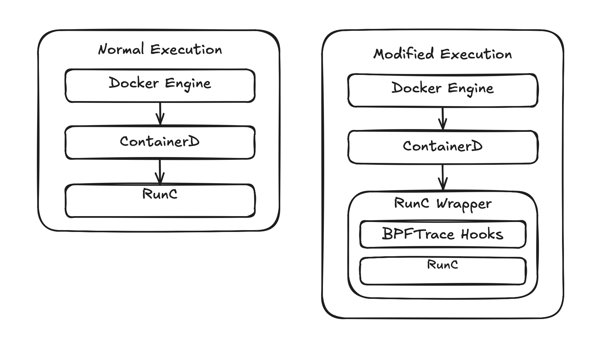

I hit a runtime error with my [manifest built](../declarative_builds/) container image.  It was caused by a missing libz dependency overlooked by lddtree. I thought
the image had everything it needed, but I was wrong.

So how does one verify what a container actually needs?

## Why static analysis fails

Using tools like `lddtree` to explore ELF dependencies only work to a point.  Binary ELF files list linked dependencies in a section named DT_NEEDED. Tooling will read the DT_NEEDED section to discover linked dependencies.  This works great for direct links, but not implicit dependencies.  

While exploring an `unbound DNS` binary, lddtree successfully listed a `libcrypto` dependency.  At runtime, libcrypto lazily loads a compression library named `libz`.
Because the library access happens at runtime, libz doesn't appear in the DT_NEEDED section of either unbound or libcrypto and is why it wasn't found by lddtree.

Another static analysis issue is knowing what files an application attempts to access. I discovered the same unbound DNS binary attempting to access nsswitch.conf, passwd,
and openssl.cnf within the /etc directory.  I also learned applications will intentionally attempt to open files that may not exist.  These attempts are probes to
detect the runtime environment or optional configs. Failed probe attempts are considered normal behavior and provide a useful signal by telling us what the
application expects might exist.

Static analysis tooling doesn't understand this behavior.

## My approach to tracing containers

I started looking into Docker APIs but quickly realized they didn't support my needs.  I needed to go deeper and ended up writing a runc wrapper called by Docker.



The wrapper is a Python script that intercepts the runc [createRuntime and poststop](https://github.com/opencontainers/runc/blob/main/libcontainer/configs/config.go#L409-L427) hooks
to attach a `bpftrace` process against the container PID for tracing `openat` system calls in the container.  This program is passed to a Python subprocess call.

```python
BPFTRACE_PROGRAM = """
tracepoint:syscalls:sys_enter_clone
/pid == {pid}/
{{ @children[tid] = 1; }}

tracepoint:syscalls:sys_enter_clone3
/pid == {pid}/
{{ @children[tid] = 1; }}

tracepoint:syscalls:sys_enter_openat
/pid == {pid} || @children[pid]/
{{ @fname[tid] = args.filename; }}

tracepoint:syscalls:sys_exit_openat
/pid == {pid} || @children[pid]/
{{
    printf("%d %d %s\\n", elapsed, args.ret, str(@fname[tid]));
    delete(@fname[tid]);
}}

END {{ clear(@children); clear(@fname); }}
"""
```

Enabling the wrapper was done with a docker-daemon.json update.

```shell
$ sudo cat /etc/docker/daemon.json 
{
  "default-runtime": "runc-traced",
  "runtimes": {
    "runc-traced": {
      "path": "/usr/local/bin/runc-wrapper"
    }
  }
}
```

When the wrapper receives a createRuntime request, it calls SIGSTOP to pause the container before its entrypoint runs.  This was discovered
while tracing `docker run --rm alpine cat /etc/os-release` and realizing the container exited before the trace could attach.  Without the
SIGSTOP window, file access attempts during dynamic linker initialization or early startup can be missed.  Once bpftrace is attached, the
runc wrapper calls SIGCONT on the container.

Bpftrace output from the running container is captured in a log file on the host.

## What the trace shows

This is partial logged output from bpftrace.  The -2 means the read attempt failed.  Notice that libz is listed as a missing file in the output, showing the limits of static analysis.

```log
98098465 -2 /lib64/libz.so
98154798 -2 /usr/lib64/libz.so
98383507 -2 /usr/lib/engines-3/gost.so
98397715 -2 /usr/lib/engines-3/gost.so
98480216 -2 /etc/ssl/openssl.cnf
```

The bpftrace trace output is then fed into a Python report generator.  By combining the manifest with bpftrace output, we can determine which files
should exist and which are missing.  The report does filtering of application probe attempts for files in /proc and /sys.  Other missing files are not always
required by the application as lookups and probes can happen outside of /proc.  An example is the gost SSL engine in the output below.

```shell
$ ./generate-report.py --show-ignored 

================================================================
  Container Dependency Report
================================================================
  Container : a07acffbfd31c222...
  Present   : 13 files
  Missing   : 3 files
  Ignored   : 16 files (kernel probes / noise)
================================================================

  FILES PRESENT / SUCCESSFULLY OPENED (13)
  --------------------------------------------------------------
  OK   /
  OK   /dev/null
  OK   /etc/nsswitch.conf
  OK   /etc/passwd
  OK   /etc/ssl/openssl.cnf
  OK   /etc/unbound/unbound.conf
  OK   /lib64/libc.so.6
  OK   /lib64/libcrypto.so.3
  OK   /lib64/libevent-2.1.so.7
  OK   /lib64/libsodium.so.23
  OK   /lib64/libssl.so.3
  OK   /lib64/libz.so
  OK   /var/run/unbound.pid

  FILES REQUESTED BUT NOT FOUND / ENOENT  (3)
  --------------------------------------------------------------
  --   /etc/group
  --   /etc/localtime
  --   /usr/lib/engines-3/gost.so

  IGNORED (kernel probes / noise)  (16)
  --------------------------------------------------------------
  --   /etc/ld.so.cache  Linker cache — optional optimisation
  ok   /proc/acpi  ACPI power management probe
  --   /proc/asound  ALSA audio subsystem probe
  ok   /proc/interrupts  Hardware interrupt table
  ok   /proc/kcore  Kernel memory ELF core
  ok   /proc/keys  Kernel keyring
  ok   /proc/latency_stats  Scheduling latency debug
  --   /proc/sched_debug  Scheduler internals debug
  ok   /proc/scsi  SCSI device list
  ok   /proc/sys/kernel/cap_last_cap  Capability number probe, has fallback
  --   /proc/sys/kernel/ngroups_max  Max groups probe, has fallback
  ok   /proc/timer_list  Kernel timer state
  --   /proc/timer_stats  Removed in Linux 4.11
  --   /sys/devices/virtual/powercap  CPU power capping (Intel RAPL)
  ok   /sys/firmware  BIOS/EFI info
  ok   /var/lib/docker/rootfs/overlayfs/a07acffbfd31c222486540fae8145d..  Docker overlay layer path (host artifact)
```

## Why is this important?

Using manifests in image builds define what should be in the container.  The validator verifies the definition against runtime behavior.
Together, the manifest and validator form a build, run, verify, refine, loop that makes the manifest approach trustworthy.  

Instead of guessing at what an image needs, it can be observed and corrected, resulting in an intentionally minimal image.
