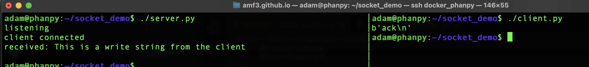

There's a popular myth in the Docker community.
The myth is that it's possible to mount /var/run/docker.sock with read only options.  Even large container projects like
[Traefik](https://github.com/traefik/traefik/blob/f7280439e6378221a541910f43a01323d52db048/docs/content/user-guides/docker-compose/basic-example/index.md?plain=1#L122)
get this wrong.

Bind mounting the Docker socket with read only options doesn't work the way one thinks it would.  This post will explain how using the
**":ro"** option when mounting the Docker socket is little more than [security theater](https://en.wikipedia.org/wiki/Security_theater) and to
discuss alternatives.  

Please read this post if you're adding `/var/run/docker.sock:/var/run/docker.sock:ro` to Docker compose files.

## Socket behavior

### Demo

The issue isn't specific to Docker, instead its normal [POSIX](https://en.wikipedia.org/wiki/POSIX) behavior.  This is easily demonstrable
by creating a Unix socket with python and not using Docker at all.

This code block will create a Unix socket and wait for clients to connect.  When the client connects, the server prints received
data to standard out.

```python3
#! /usr/bin/env python3
# Save as server.py
import socket
import os

SOCK = "/tmp/control.sock"

try:
    os.unlink(SOCK)
except FileNotFoundError:
    pass

srv = socket.socket(socket.AF_UNIX, socket.SOCK_STREAM)
srv.bind(SOCK)
os.chmod(SOCK, 0o660)   # same write permissions that are used with docker.sock
srv.listen(1)

print("listening")

conn, _ = srv.accept()
print("client connected")

while True:
    data = conn.recv(1024)
    if not data:
        break
    print("received:", data.decode())
    conn.sendall(b"ack\n")

```

The next block contains the client code.  Notice that the client socket path (/mnt/control.sock) is different from the server (/tmp/control.sock)
as it's using the read only bind mount created in the next step.

```python3
#! /usr/bin/env python3
# Save as client.py
import socket

sock = socket.socket(socket.AF_UNIX, socket.SOCK_STREAM)
sock.connect("/mnt/control.sock")   # connect to read-only mount point

sock.sendall(b"This is a write string from the client\n")
print(sock.recv(1024))
```

Start the server code to create `/tmp/control.sock` and then bind mount the socket
to a new mount point with read-only access.

```shell
$ sudo touch /mnt/control.sock                           # create the mount point
$ sudo mount --bind /tmp/control.sock /mnt/control.sock  # mount the socket to a new mount point
$ sudo mount -o remount,ro,bind /mnt/control.sock        # Remount the socket mount point with read only options

$ mount | grep control.sock                              # Display the read-only mount
tmpfs on /mnt/control.sock type tmpfs (ro,nosuid,nodev,size=16037780k,nr_inodes=1048576,inode64) 
```

Next run the client.  At this point it **should not** be possible to write to the socket, but this screen shot shows otherwise.



If running the demo locally, don't forget to clean up the bind mount.

```shell
sudo umount /mnt/control.sock  # unmount the read-only bind mount
sudo rm /mnt/control.sock      # remove the mount point
rm /tmp/control.sock           # remove the control.sock socket created by the python server code.
```

### How did this work?

A bind mount creates a second path to the same underlying kernel object. The "ro" mount option applies filesystem level
restrictions at the mount point, but does not change the behavior or permissions of the object being mounted.
When a process opens the object, further access control is determined by the object itself.

In this case, I'm unable to delete the socket or change its metadata, but I can still connect to it.


The read and write behavior for a socket is different from a normal file. Files use the [read()](https://man7.org/linux/man-pages/man2/read.2.html)
and [write()](https://man7.org/linux/man-pages/man2/write.2.html) system calls, sockets use
[send()](https://man7.org/linux/man-pages/man2/send.2.html) and [recv()](https://man7.org/linux/man-pages/man2/recv.2.html) system calls. The
read only mount option to the mount point representing the socket allows the client connection.  As send() is a different system call from
write(), send() is not blocked by the filesystem and data passes through the socket.

Socket behavior is the big misunderstanding in the Docker community. People conflate filesystem writes with sending
commands over a socket.

## Docker API

Docker defaulting to using Unix sockets isn't the problem. The issue is that the Docker API is course grained and was not built with
multitenancy in mind. While the [Docker API](https://docs.docker.com/reference/api/engine/version/v1.52/#tag/Container) is built on HTTP
verbs, the HTTP endpoints don't map cleanly between safe and unsafe operations.  This makes verb based authorization ineffective
and explains why granting a container access to the Docker socket implicitly grants elevated capabilities for that container.

This example only uses HTTP GET requests to demonstrate the missing separation of safe and unsafe operations in the Docker API. The
example is able to exfiltrate TLS certificates from a running container. No container restart, privilege escalation, or filesystem write is required.

```bash
$ # Get a list of running containers
$ curl -s --unix-socket /var/run/docker.sock -X GET http://localhost/containers/json | jq '.[] | {Names, Id, Image}' 
{
  "Names": [
    "/cadvisor"
  ],
  "Id": "dfe1461c0a7a1a34bd0b4df6ccc1ecd77d1fc6483be80c248ef916a3e79d8bc9",
  "Image": "gcr.io/cadvisor/cadvisor:v0.52.1"
}

$ # Exfiltrate certificates from the running cAdvisor container and save locally to a file named certificates.tar
$ curl -D - -s  --unix-socket /var/run/docker.sock -X GET http://localhost/containers/dfe1461c0a7a1a34bd0b4df6ccc1ecd77d1fc6483be80c248ef916a3e79d8bc9/archive?path=/etc/ssl -o certificates.tar 
HTTP/1.1 200 OK
Api-Version: 1.51
Content-Type: application/x-tar
Docker-Experimental: false
Ostype: linux
Server: Docker/28.5.2 (linux)
X-Docker-Container-Path-Stat: eyJuYW1lIjoic3NsIiwic2l6ZSI6MTAsIm1vZGUiOjIxNDc0ODQxNDEsIm10aW1lIjoiMjAyNS0wMi0xM1QyMzoxNzowOFoiLCJsaW5rVGFyZ2V0IjoiIn0=
Date: Fri, 09 Jan 2026 17:04:45 GMT
Transfer-Encoding: chunked

$ # List the contents of the uncompressed downloaded tar archive
$ tar -tf certificates.tar 
ssl/
ssl/cert.pem
ssl/certs/
ssl/certs/ca-certificates.crt
ssl/ct_log_list.cnf
ssl/ct_log_list.cnf.dist
```

Containers like cAdvisor or Traefik want access to the docker socket.  These are large projects and it's unlikely they would intentionally 
publish harmful code.  But supply chain attacks are common and it's possible for malicious behavior to be introduced into a normally trusted
container.

When a container is granted access to the Docker socket, it implicitly inherits the full authority of the Docker API.  Docker does not have a
mechanism to distinguish between intended and unintended use of the API or a way to scope capabilites. This limitation is why socket proxies
exist, providing the missing authorization layer in Docker.

## Socket Proxies

A local proxy in front of the Docker socket can filter the endpoints a container can access.  Identity based solutions like
[Open Policy Agent](https://www.openpolicyagent.org) are available and work well for human users with authentication tokens. But
containers don't use custom headers or use mTLS by default. The application code within the container would need to be modified
to send authentication with its requests.

This is why most socket proxy projects use topology for authentication and authorization.  The proxy is deployed
in a [side car](https://learn.microsoft.com/en-us/azure/architecture/patterns/sidecar) pattern with the application container, where
Docker socket access from the application container passes through the socket proxy container.  In topology based sidecar deployments,
**where** the request comes from determins what the request can do, not who is making the request.


Popular socket proxy projects are [Tecnativa socket-proxy](https://github.com/Tecnativa/docker-socket-proxy) which uses HAProxy with configurable
endpoint filtering, and [Wollomatic socket-proxy](https://github.com/wollomatic/socket-proxy) a Go based alternative. You configure these proxies
to allow specific endpoints. Like allowing Traefik access `containers/json` to discover services while blocking request to `containers/create`.

### Tradeoffs

There's no true identity-based authorization.  The proxy can't distinguish between legitmate requests from Traefik versus another container. The proxy
only knows requests coming from particular networks get particular permissions.

Duplicated infrastructure is another concern.  Each application needs its own proxy instance.  Running three containers that need Docker socket
access, results in configuring and deploying three separate proxies.
  
Policy/filter configuration within the proxy is static and set at deployment time.  It's not possible to dynamically adjust permissions based
on runtime conditions.

The Docker API design sneaks through proxy endpoints.  It's not possible to grant access to
[container labels](https://docs.docker.com/reference/api/engine/version/v1.52/#tag/Image/operation/ImageInspect) without granting access to environment
variables, the latter likely contain application secrets.

Even with these limitations, socket proxies provide a significant security improvement over direct Docker socket mounts.  Socket proxies enforce
least privilege access at the API level, which is exactly where the authorization needs to happen.

## What's Next?

If you're currently mounting the Docker socket from your containers with `:ro` consider switching to a socket proxy solution.  The topology
based approach isn't perfect but it provides Docker API filtering that read only mounts can't.  Yes a socket proxy requires more setup, but it
provides a real security boundary rather than the appearance of one.

If you have thoughts on this content, let me know what you think on [Bluesky](https://bsky.app/profile/af9.us).
