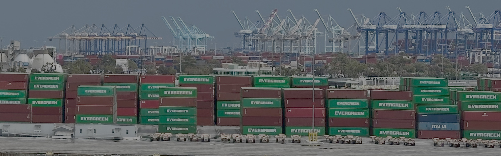

Forget about needing Docker's buildx or Redhat's buildah for this OCI container image deep dive. I will explain the OCI container image
model and demonstrate building a new container image with a little JSON and a few SHA256 hash sums.  You will understand that container images 
aren't a file you download, but instead a graph of nodes and how the nodes are addressed after reading this article.

## The Build Artifact

A build artifact is the reproducible output created after building an application. The artifact is complete and contains all neccessary
directories, compiled binaries, configs, libraries, and a directory structure.  Often this is packged as a tar archive (tar) or zip file,
but isn't a requriement.  The artifact contains everything needed for the application to execute in its intended environment, (arm, x86, linux,
windows).  There are no container specific files within the artifact, it's just a directory tree of files.

Convention refers to the directory tree as a **root filesystem** when working with container images.  This is due to the
directory tree being mounted at / inside the container.  The root fs is not a block device filesystem like ext4.

## OCI Container Image Description

A container image consists of a root filesystem and a set of JSON documents describing how the filesystem should be used.
Each component of the image is stored as a content addressible blob, identified by the SHA256 hash of the blobs contents.  Because identity is
derived from content, any modification produces a new digest and a new image identitify instead of mutating the existing image.

The image contains a manifest file which ties the blobs together.  The manifest references the filesystem layers and configuration file by
their SHA256 digests.  The configuration file defines how to run the filesystem as a container by listing what process to start, the target 
operating system, CPU architecture, environment variables, working directory and other execution settings.

Additional metadata can be associated with an image after its created, like a Software Bill of Materials. This is done by publishing a
seperate artifact that references the images manifest digest.  Associating metadata by reference keeps the original image unchanged.

Because a container image is composed of multiple content addressible blobs connected by digest references, it does not exist as a single 
downloadable file.  Instead a container image forms a directed graph of nodes, a manifest pointing to configuration and layer blobs, and 
potentially additional artifacts pointing back to the manifest. Container tooling understands how to traverse this graph and retrieve the 
referenced content.

## Elements of a OCI Container Image

When stored on disk, the graph of object addressable objects is represented using a
[standard layout](https://github.com/opencontainers/image-spec/blob/main/image-layout.md). The layout stores objects by hash and the
JSON descriptors define the edges between those objects. Each object is stored under `blobs/<algorithm>/<digest>`, where the filename is the
cryptographic hash of its contents. If the contents change, the filename must change.
	
```
.
├── blobs
│   └── sha256
│       ├── 17eec7bbc9d79fa397ac95c7283ecd04d1fe6978516932a3db110c6206430809
│       ├── 1b44b5a3e06a9aae883e7bf25e45c100be0bb81a0e01b32de604f3ac44711634
│       └── 2771e37a12b7bcb2902456ecf3f29bf9ee11ec348e66e8eb322d9780ad7fc2df
├── index.json
└── oci-layout

```

The `oci-layout` file declares that the top level directory follows the OCI Image Layout specification and indicates the layout version.

```
{
    "imageLayoutVersion": "1.0.0"
}
```

The `index.json` file is the entry point of the container image and the root of the graph. The **tag** "latest"
("org.opencontainers.image.ref.name": "latest") is mapped to a specific digest
(digest": "sha256:2771e37a12b7bcb2902456ecf3f29bf9ee11ec348e66e8eb322d9780ad7fc2df") that is marked as the **manifest**
("mediaType": "application/vnd.oci.image.manifest.v1+json").

```
{
  "schemaVersion": 2,
  "manifests": [
    {
      "mediaType": "application/vnd.oci.image.manifest.v1+json",
      "digest": "sha256:2771e37a12b7bcb2902456ecf3f29bf9ee11ec348e66e8eb322d9780ad7fc2df",
      "size": 1035,
      "annotations": {
        "org.opencontainers.image.ref.name": "latest"
      }
    }
  ]
}
```

The `manifest` at blobs/sha256/2771e...c2df declares the
image configuration and the
ordered set of filesystem layers. This example contains a single filesystem layer.  In general, the
**layers** array can contain multiple entries, which are applied in order to construct the root
filesystem.

```
{
  "schemaVersion": 2,
  "mediaType": "application/vnd.oci.image.manifest.v1+json",
  "config": {
    "mediaType": "application/vnd.oci.image.config.v1+json",
    "digest": "sha256:1b44b5a3e06a9aae883e7bf25e45c100be0bb81a0e01b32de604f3ac44711634",
    "size": 547
  },
  "layers": [
    {
      "mediaType": "application/vnd.oci.image.layer.v1.tar+gzip",
      "digest": "sha256:17eec7bbc9d79fa397ac95c7283ecd04d1fe6978516932a3db110c6206430809",
      "size": 2380
    }
  ],
...
```

The trust chain is explicit with a container image. The entry point, index.json, selects a
[manifest by digest](https://github.com/opencontainers/image-spec/blob/main/media-types.md). The
manifest selects its config and ordered filesystem layers by digest. The filename of each object under
blobs/sha256 must match its contents hash.

When selecting an image by tag, we are unknowingly selecting by digest.  While tags are mutable references, digests are not. This is why the
tag "latest" can reference a different digest then the one currently in use.

## OCI Container Image Demo

We will construct an OCI container image manually to demonstrate that an image consists only of content addressed blobs and a few
JSON documents.  This is not a production workflow. The goal is to expose the model, not replace existing tooling.  Because higher 
level objects reference lower level objects by digest, construction begins with the leaves of the graph. Any modification
to an object would change the layer digest, which would in turn invalidate the config and manifest digests above it. 

Begin with creating a staging directory for building our conatiner image and the compiled application.  The application is statically
compiled and named **hello**. It prints a greeting defined by the [GREETING](./assets/hello.go) environment variable, else it prints "Hello World".

```sh
$ mkdir -p myapp/blobs/sha256
$ tree myapp
myapp
└── blobs
    └── sha256

$ ./build/hello 
HELLO WORLD!!!
$ GREETING="HELLO ADAM" ./build/hello 
HELLO ADAM
```

Next turn the "hello" application into a root filesystem blob.  Currently the build artifact is in the "./build" directory which
gets archived with tar.  Compute the SHA256 digest on the tar archive and the archive is copied to the staging directory.

```sh
$ tree build/
build/
└── hello

$ tar --numeric-owner --owner=0 --group=0 -cf layer.tar -C build .
$ sha256sum layer.tar 
0f11da71a27abfb549ba01cc400d393388116da84abb5f092572c5f2146398cb  layer.tar

$ cp layer.tar myapp/blobs/sha256/0f11da71a27abfb549ba01cc400d393388116da84abb5f092572c5f2146398cb

$ tree myapp/
myapp/
└── blobs
    └── sha256
        └── 0f11da71a27abfb549ba01cc400d393388116da84abb5f092572c5f2146398cb

```	

Create a config object which tells the container runtime how to execute the filesystem. For simplicity this example uses an uncompressed tar
archive. The diff_ids value matches the layer digest.

```sh
$ cat config.json 
{
  "architecture": "amd64",
  "os": "linux",
  "config": {
    "Env": [],
    "Entrypoint": ["/hello"]
  },
  "rootfs": {
    "type": "layers",
    "diff_ids": [
      "sha256:0f11da71a27abfb549ba01cc400d393388116da84abb5f092572c5f2146398cb"
    ]
  }
}

$ sha256sum config.json
f86f75f0d7a7dd4c951a158aca51894ab59f46b0348558a341a589bfcc0d253c  config.json

$ cp config.json myapp/blobs/sha256/f86f75f0d7a7dd4c951a158aca51894ab59f46b0348558a341a589bfcc0d253c
```

The manifest binds the configuration and layer digests into a single image descriptor. The manifest
file also gets hashed and stored in the staging directory.

```sh
$ cat manifest 
{
  "schemaVersion": 2,
  "mediaType": "application/vnd.oci.image.manifest.v1+json",
  "config": {
    "mediaType": "application/vnd.oci.image.config.v1+json",
    "digest": "sha256:f86f75f0d7a7dd4c951a158aca51894ab59f46b0348558a341a589bfcc0d253c",
    "size": 255
  },
  "layers": [
    {
      "mediaType": "application/vnd.oci.image.layer.v1.tar",
      "digest": "sha256:0f11da71a27abfb549ba01cc400d393388116da84abb5f092572c5f2146398cb",
      "size": 1914880
    }
  ]
}

$ sha256sum manifest
d6fceb45932ad49b50f9a1e24b21691b60f861bf46ed9e4a47bd74b8401a2ecd  manifest

$ cp manifest myapp/blobs/sha256/d6fceb45932ad49b50f9a1e24b21691b60f861bf46ed9e4a47bd74b8401a2ecd
```

Finally create the container entry point and declare the myapp directory is the top level directory of a OCI compliant image.

```sh
$ cat myapp/index.json
{
  "schemaVersion": 2,
  "manifests": [
    {
      "mediaType": "application/vnd.oci.image.manifest.v1+json",
      "digest": "sha256:d6fceb45932ad49b50f9a1e24b21691b60f861bf46ed9e4a47bd74b8401a2ecd",
      "size": 476,
      "annotations": {
        "org.opencontainers.image.ref.name": "latest"
      }
    }
  ]
}

$ cat myapp/oci-layout
{
  "imageLayoutVersion": "1.0.0"
}
```

The image layout is now complete. We can import it into a runtime and execute it.

```
adam@charizard:~/foo/demo$ skopeo copy oci:./myapp docker-daemon:myapp:latest
Getting image source signatures
Copying blob 0f11da71a27a done   | 
Copying config f86f75f0d7 done   | 
Writing manifest to image destination

$ docker run --rm myapp:latest 
HELLO WORLD!!!
$ docker run --rm -e GREETING="Hello OCI image" myapp:latest 
Hello OCI image
```

## Why the Model Matters

Understanding that a container image is a graph of content addressible blobs isn't trivia.  You gain several advantages when you stop seeing the image as a "magic file" and start seeing it
as a verifiable manifest.

**Tooling:** Stop worrying about whether Docker is better than Podman. They are just different UI wrappers for the same OCI specification. Tooling becomes an implementation detail.

**Debugging:** When an image is bloated or a layer is flagged by a security scanner, you don't need specialized tools to tell you why.  By inspecting the graph, you can identify exactly which
object introduced the content and then inspect that specific content.

**Supply Chain Confidence:** By understanding that identity is derived from content you can verify image integrity or attach metadata (like SBOMs) with
confidence, knowing that objects bind to the manifest digest.

## Closing

My next article will use these principals in constructing a minimal distroless image without using a base image or package manager. Reach out on
[BlueSky social](https://bsky.app/profile/af9.us) to let me know if these topics are useful or interesting.
