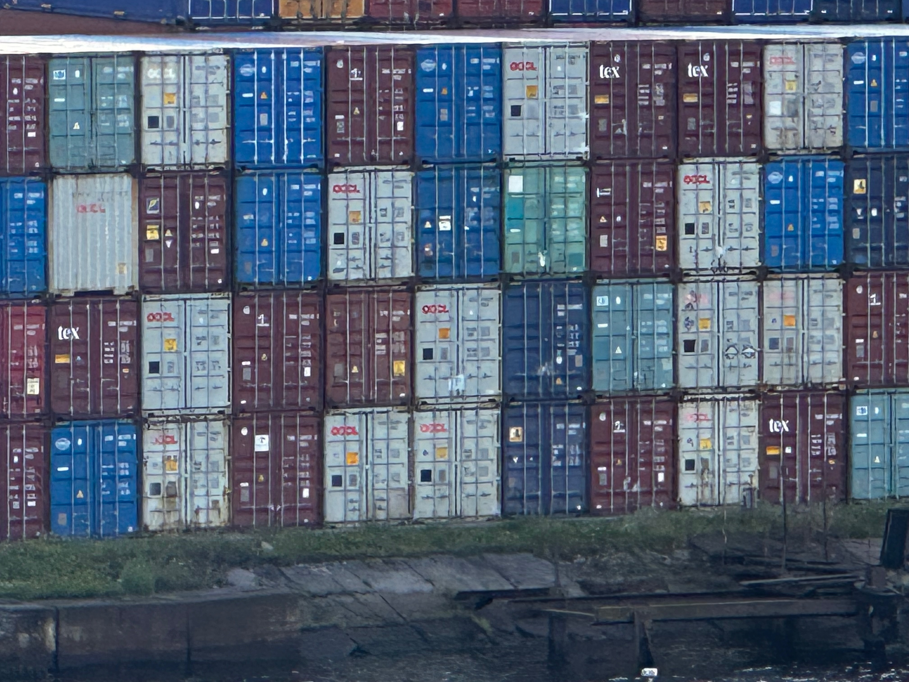
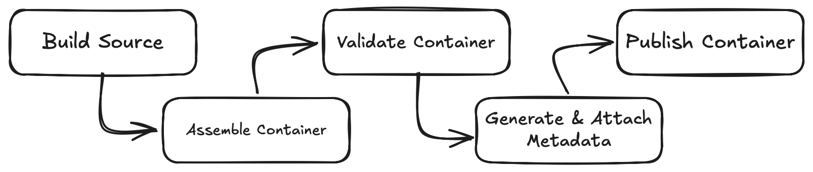
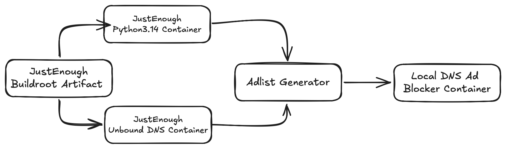

## Intro

I've been working on the [JustEnough](https://github.com/amf3/just_enough) project on and off for the last several years.  It started after examining upstream container images and realizing they could be a lot simpler.

After watching a presentation from [Brian Harrington](https://www.youtube.com/watch?v=gMpldbcMHuI) of CoreOS fame, I started using Buildroot to create a minimal root filesystem that got imported into the container image.  This worked great for a single container image, but got unwieldy when building multiple container images.  

The maintenance issues led me to writing about [declarative manifests](../virtualization/declarative_builds/index.html) for assembling OCI images a few months ago.  Today I'm currently managing three base images using this process.

| JustEnough Image | Image Description |
| :----: | :-----: |
| [BusyBox](https://github.com/amf3/just_enough/pkgs/container/just_enough%2Fbusybox) | minimal utility/debugging image |
| [Python3.14](https://github.com/amf3/just_enough/pkgs/container/just_enough%2Fpython3.14) | Application Runtime |
| [Unbound DNS](https://github.com/amf3/just_enough/pkgs/container/just_enough%2Funbound_dns) | Infrastructure Service |

I have plans to introduce a fourth base image that will be discussed later.

## The Maintenance Challenge

Like many projects, time and effort were the reasons for changing the build process of using a single Buildroot filesystem per container image to using declarative builds.

My build times were growing rapidly by using distinct Buildroot configs for each container image.  This isn't a Buildroot issue, but an implementation issue I introduced.  By recreating common components like GCC for the build toolchain or glibc within the image, build times skyrocketed.  It wouldn't have mattered if I was using other projects like Yocto or Linux From Scratch to build the root filesystem.  The build time issue was I kept rebuilding common components for each container base image.

A second challenge was keeping multiple Buildroot config files in sync.  When the upstream Buildroot project deprecated a package, I needed to remove that package from each of my local Buildroot config files.  

So why not use individual Dockerfiles in place of Buildroot? In summary, it's because we don't actually know what's inside an upstream container image.  A lot of [base container images](../base_image/index.md) are distro based, where files and applications are stripped from the final image.  Another problem is upstream content can change without notice.  An upstream distro package the container image is using can have its contents change without the image maintainer realizing it.  

Using a single Buildroot filesystem artifact containing multiple packages have both reduced my build times and simplified updates to Buildroot configs.  While I do use unique Dockerfiles for each of the JustEnough base images, Dockerfile content is essentially copy everything from each container image's staging directory into a scratch image.

## From Primitives to a Distribution

Several reusable primitives evolved when writing about declarative builds.

**Buildroot** is responsible for creating the source filesystem artifact. The artifact contains application binaries and their dependencies. All container images use files from the same source filesystem artifact.  While Buildroot is the current source of the filesystem artifact, it's not a requirement.  The source filesystem artifact only needs to be a directory structure containing binaries and their dependencies.

The **Container Manifest** is a [YAML file](https://github.com/amf3/just_enough/blob/main/project_manifest/docs/manifest.md) that defines what goes into a container image.  There are several top level keys that describe the container's filesystem. *Binaries* list compiled binaries, *Data* entries track data components like config files, *Directories* ensure that directory structures are present in the container image, and *Symlinks* track symbolic links.

An **Assembler** uses the Container Manifest to copy files from the Buildroot filesystem artifact into a staging directory specific to that container image.

To confirm container images have required libraries and filesystem paths, a **Validator** process uses eBPF to track system calls made by the running container process.  The Validator helps identify missing runtime files, so the Container Manifest can be updated before the image is uploaded to a public registry like GHCR.

## Build and Release Pipeline

The pipeline uses GitHub Actions, but could be any command runner capable of running shell commands and scripts.



### Build the Source Filesystem Artifact

The actual pipeline begins with building the source filesystem artifact with Buildroot.  This is created once for all container images. My current BusyBox, Python, and Unbound DNS images are based from this one artifact.  With this approach, I use [Oras](https://oras.land) to push the source filesystem artifact to [GHCR](https://github.com/amf3/just_enough/pkgs/container/just_enough%2Fkitchen-sink) where it can be accessed by other pipelines or inspected as a standalone layer.

### Assemble the Container Image

The manifest file describes the intentional contents of the image. The assembler discovers the dependencies needed to make those contents executable.

Manifest entries under Binaries receive special handling. The ELF header is inspected for dependencies and automatically get copied to the container's staging directory. This is why we don't need to list libc.so.6 in the manifest.

### Validate the container image

We still need to validate the container image, even after static analysis of reading ELF header from the binaries.  Sometimes libraries are lazily loaded at runtime or access unexpected file paths like */etc/openssl.cnf* by Unbound DNS.

After tracing system calls made by the running container, the [Validator generates a report](../container_validation/index.md) detailing file read and write access attempts.  Reading the report is more art than science as libraries often probe non-existent paths to inspect the local environment, meaning failed file access attempts aren't always a failure condition.

Validation remains a manual step because the system call output isn't deterministic.  Additional work is needed to normalize the runtime traces before using GitHub actions.

### Generate Metadata and Release

During container assembly, a Software Bill of Materials (SBOM) is generated from the staging directory and inserted into each container image as it's being built.

After the the container image is created, attestation is added to state which GitHub Action Build number built that container and which git tag from the Buildroot project was used to generate the Buildroot artifact.

Finally the container image with updated tags is pushed to GHCR container registry.

## Keeping Images Updated

The release tag from the upstream Buildroot project is attached to the newly created container image.  I also tag the container image with the current git hash from the JustEnough project.  Together, these tags identify both the Buildroot source used to build the image and the JustEnough configuration that assembled it.  This makes it possible to identify how an existing release was built.

It's possible to use [local patches](https://buildroot.org/downloads/manual/manual.html#_adding_project_specific_patches_and_hashes) with Buildroot and override the project settings.  This is useful for when the Buildroot project is in the middle of a release cycle and I need to patch a critical CVE within the container.  Creating a package patch isn't complicated.  Each package has a [*.mk file](https://gitlab.com/buildroot.org/buildroot/-/blob/2026.05.1/package/unbound/unbound.mk) which contains the upstream version number and upstream git hash, both of which can be easily overridden.  Patching is also how one can add or remove build options for a package.

## Creating a New Image

Because of the primitives listed above, creating a new container image is simple. These are the steps I took when adding a new Python interpreter as a base image.

- Enable the Python 3.14 and Pip packages in the Buildroot config.
- Create a container manifest file that lists the Python and Pip binaries with their dependencies.
- Create a Dockerfile to copy content from the containers staging directory into the new container.
- Use the Validator tool to confirm the new container image is working
- Add the new Python container to an [appliance array](https://github.com/amf3/just_enough/blob/90316a9002d013803758ee80849bf5e68a66328c/.github/workflows/appliance_pipeline.yml#L33) within the GitHub workflow.

With the new build pipeline, the updates are mostly additions and modifications are minimal.

## Generated Images as Building Blocks

To validate these images with real world usage, also known as dogfooding the project, I needed a service to build with those components.  I wanted a self hosted DNS based advertisement blocking service at home as a lightweight alternative to the Pihole project.  In addition to ad list support, I wanted a local resolver, split-horizon records, and reporting.  The Pihole replacement seemed like a great test case.

I ended up using the Python and Unbound images for the foundation of the [adlist generator](https://github.com/amf3/adlist_generator) project that downloads ad-block lists and generates a local DNS based ad blocker.



The Python container image provided the runtime for the generator.  Unbound provides the DNS resolver.  The adlist generator is a Python project that downloads ad block lists and formats them to be used with Unbound DNS. The generator also writes Unbound DNS configs to support the other features I listed.

I ran into one minor issue when using the Python and Unbound DNS container images in a multi-stage build for the adlist generator. I found out the pip command expects a shell environment. As there's no shell in my containers, I needed to invoke the pip command as a module. You can see this in the generator project's Dockerfile.

```
RUN ["python", "-m", "pip", "install", "--no-cache-dir", "-r", "requirements.txt"]
```

Otherwise, using the JustEnough container image as building blocks worked great.

## What's Next

In the intro I mentioned a fourth container is planned.  I want to create a Samba container image that's focused on Apple's Time Machine backups.  

The existing images are straightforward application runtimes and static utilities.  The Samba container image will be a more demanding test of the pipeline, because of dynamic configurations, user/group permission mappings, and persistent storage mounts.

Supporting stateful container images will show which declarative primitives hold up, which need to evolve, and whether the design can scale beyond the simple images the project started with.
